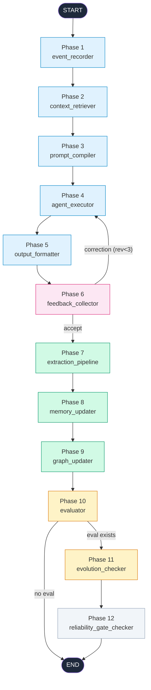

# Self-Prompt-Update Agent

<p align="center">
  
  
  
</p>

<p align="center">
  <b>自优化 Prompt 全链路 Agent</b><br>
  <i>Recording → Retrieval → Prompt → Execution → Feedback → Memory → Graph → Evaluation → Evolution → Gate</i>
</p>

---

## 概述

**Self-Prompt-Update Agent** 是一个基于 [LangGraph](https://langchain-ai.github.io/langgraph/) 构建的全链路 Agent 框架。每次用户交互经过 12 个阶段性节点，形成从记录到进化的完整闭环。

### 核心能力

| 能力 | 说明 |
|---|---|
| **全链路追踪** | 每个请求生成 `trace_id`，贯穿 12 个 Phase |
| **自我修正** | 反馈驱动修订，最多 3 轮修正循环 |
| **长期记忆** | 三层记忆架构（工作/长期/技能），自动抽取与合并 |
| **用户图谱** | 节点/边关系表，支持实体归一化与图邻居排序 |
| **AI 评测** | completion / style / relevance 多维度评分 |
| **自主进化** | 低于阈值自动触发 Prompt/Skill 进化提案 |
| **发布门禁** | ReliabilityGate：scope/敏感信息/注入/回归/SLO 检查 |

---

## 架构图



---

## 全链路流程

```
                     +--------------------------------------+
                     |         User Input                   |
                     +--------------+-----------------------+
                                    |
                                    v
              +-----------------------------------------+
     Phase 1  |  event_recorder                         |
              |  记录用户输入，生成 trace_id              |
              +------------------+----------------------+
                                 |
                                 v
              +-----------------------------------------+
     Phase 2  |  context_retriever                      |
              |  RAG 检索：记忆 / 画像 / 项目知识/ 图谱   |
              +------------------+----------------------+
                                 |
                                 v
              +-----------------------------------------+
     Phase 3  |  prompt_compiler                        |
              |  编译结构化个性化 Prompt 包              |
              +------------------+----------------------+
                                 |
                                 v
              +-----------------------------------------+
     Phase 4  |  agent_executor                         |
              |  推理 -> 工具调用 -> 执行结果              |
              +------------------+----------------------+
                                 |
                                 v
              +-----------------------------------------+
     Phase 5  |  output_formatter                       |
              |  格式化最终输出                          |
              +------------------+----------------------+
                                 |
                                 v
              +-----------------------------------------+
     Phase 6  |  feedback_collector                     |
              |  判断反馈类型                            |
              +------------------+----------------------+
                                 |
                     +-----------+-----------+
                     | feedback_quality      |
                     | _router               |
                     +-----------+-----------+
                     |           |
                 correction    accept
                 (rev < 3)      |
                     |           v
                     v  +-----------------------+
              +---------+ |  Phase 7             |
              | Phase 4 | | extraction_pipeline  |
              | (重执行) | | 抽取元数据/记忆/关系  |
              +---------+ +---------+-----------+
                                     |
                                     v
                          +-----------------------+
                 Phase 8  |  memory_updater        |
                          |  合并记忆 / 冲突/ 衰退  |
                          +-----------+-----------+
                                     |
                                     v
                          +-----------------------+
                 Phase 9  |  graph_updater         |
                          |  归一化节点/边 -> 图谱   |
                          +-----------+-----------+
                                     |
                                     v
                          +-----------------------+
                 Phase 10 |  evaluator             |
                          |  AI judge 评分         |
                          +-----------+-----------+
                                     |
                          +----------+-----------+
                          |  evolution_router    |
                          +----------+-----------+
                          | eval 存在 |  无 eval  |
                          +----+-----+-----+-----+
                               |           |
                               v           v
                     +------------+   +----------+
            Phase 11 | evolution  |   |   END    |
                     | 进化检查    |   |          |
                     +-----+------+   +----------+
                           |
                           v
                +---------------------------+
       Phase 12 |  reliability_gate         |
                |  _checker                  |
                |  scope/敏感信息/注入/回归/SLO |
                +-------------+-------------+
                              |
                              v
                          +------+
                          | END  |
                          +------+
```

---

## 快速开始

### 1. 环境准备

```bash
# 创建 conda 环境
conda env create -f environment.yml
conda activate langgraph-self-prompt

# 或使用 pip
pip install -r requirements.txt
```

### 2. 验证骨架编译

```bash
python -c "
from main import build_graph
g = build_graph()
print('Graph compiled:', [k for k in g.get_graph().nodes])
"
```

输出：
```
Graph compiled: ['__start__', 'event_recorder', 'context_retriever', 'prompt_compiler',
'agent_executor', 'output_formatter', 'feedback_collector', 'extraction_pipeline',
'memory_updater', 'graph_updater', 'evaluator', 'evolution_checker',
'reliability_gate_checker', '__end__']
```

---

## 项目结构

```
.
+-- main.py                  # LangGraph 图构建入口（仅 build_graph()）
+-- graph/
|   +-- state.py             # GraphState -- 全链路状态定义（26+ 字段）
|   +-- nodes.py             # 12 个节点函数 (Phase 1-12)
|   +-- edges.py             # 2 个条件路由
|   +-- __init__.py          # 统一导出
|   +-- overview.md          # 图流程可视化文档
+-- plan/
|   +-- plan.md              # 完整系统设计计划书 (1348 行)
+-- .env                     # LLM 配置（可选）
+-- environment.yml          # Conda 环境
+-- requirements.txt         # Pip 依赖
```

---

## 12 个 Phase

| Phase | 节点 | 职责 | plan.md |
|---|---|---|---|
| **P1** | event_recorder | 记录交互事件、生成 trace_id | §7.1 |
| **P2** | context_retriever | 混合检索：记忆/画像/图谱邻居 | §9 |
| **P3** | prompt_compiler | 编译 8 组件结构化 Prompt 包 | §10 |
| **P4** | agent_executor | 推理 → 工具调用 → 执行结果 | Agent |
| **P5** | output_formatter | 格式化最终用户输出 | — |
| **P6** | feedback_collector | 收集/判断反馈类型 | §7.1 |
| **P7** | extraction_pipeline | 抽取任务元数据、记忆候选、图谱候选 | §7.2 |
| **P8** | memory_updater | 长期记忆写入/合并/衰退 | §6/§13 |
| **P9** | graph_updater | 节点/边归一化入库与图谱清理 | §5.6/§8 |
| **P10** | evaluator | AI judge 多维度评分 | §12 |
| **P11** | evolution_checker | Prompt/Skill 进化提案 | §11/§17 |
| **P12** | reliability_gate_checker | 安全与质量门禁检查 | §17 |

**2 个条件路由**：`feedback_quality_router`（修正/提取）→ `evolution_router`（进化/结束）。

---

## 技术栈

| 类别 | 技术 |
|---|---|
| **框架** | LangGraph 1.2.9 + LangChain 1.3.14 |
| **LLM** | 豆包 (Volcengine) / OpenAI 兼容 |
| **语言** | Python 3.12 |
| **状态管理** | LangGraph StateGraph (TypedDict) |

---

## 许可证

MIT
