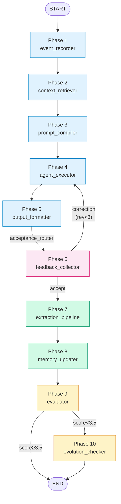

# Graph 模块概览

## 1. 简述

本项目实现了一个**自优化 Prompt Agent** 的 LangGraph 全链路管道，包含 10 个核心 Phase，覆盖从用户输入到进化的完整闭环：

| Phase | 节点 | 职责 |
|---|---|---|
| **Phase 1** | [event_recorder](nodes.py) | 记录交互事件、生成 `trace_id` |
| **Phase 2** | [context_retriever](nodes.py) | 混合检索：用户画像、项目知识、历史记忆 |
| **Phase 3** | [prompt_compiler](nodes.py) | 编译结构化个性化 Prompt 包 |
| **Phase 4** | [agent_executor](nodes.py) | 执行任务：推理 → 工具调用 → 产出 |
| **Phase 5** | [output_formatter](nodes.py) | 格式化最终用户输出 |
| **Phase 6** | [feedback_collector](nodes.py) | 收集/判断用户反馈（accept / correction） |
| **Phase 7** | [extraction_pipeline](nodes.py) | 抽取任务元数据、记忆候选、图谱关系 |
| **Phase 8** | [memory_updater](nodes.py) | 更新长期记忆、合并冲突、执行衰退 |
| **Phase 9** | [evaluator](nodes.py) | AI judge 评分（completion / style / relevance） |
| **Phase 10** | [evolution_checker](nodes.py) | 判断是否触发 Prompt/Skill 进化提案 |

**3 个条件路由**（[edges.py](edges.py)）控制管道分支：

| 路由 | 决策逻辑 |
|---|---|
| `acceptance_router` | 输出后始终进入反馈收集 |
| `feedback_quality_router` | correction → 回 Phase 4 修订（最多 3 次）；accept → 进入抽取 |
| `evolution_router` | 评分 < 3.5 → 进化提案；否则 END |

**状态定义**（[state.py](state.py)）：`GraphState` TypedDict 承载 20+ 字段，覆盖 10 个 Phase 的全部输入输出。

## 2. Mermaid



## 3. 流程图

```
                    ┌──────────────────────────────────────┐
                    │         User Input                   │
                    └──────────────┬───────────────────────┘
                                   ▼
              ┌─────────────────────────────────────────┐
     Phase 1  │  event_recorder                         │
              │  记录用户输入，生成 trace_id              │
              └──────────────────┬──────────────────────┘
                                 ▼
              ┌─────────────────────────────────────────┐
     Phase 2  │  context_retriever                      │
              │  RAG 检索：记忆 / 画像 / 项目知识        │
              └──────────────────┬──────────────────────┘
                                 ▼
              ┌─────────────────────────────────────────┐
     Phase 3  │  prompt_compiler                        │
              │  编译结构化个性化 Prompt 包              │
              └──────────────────┬──────────────────────┘
                                 ▼
              ┌─────────────────────────────────────────┐
     Phase 4  │  agent_executor                         │
              │  推理 → 工具调用 → 执行结果              │
              └──────────────────┬──────────────────────┘
                                 ▼
              ┌─────────────────────────────────────────┐
     Phase 5  │  output_formatter                       │
              │  格式化最终输出                          │
              └──────────────────┬──────────────────────┘
                                 │
                     ┌───────────┴───────────┐
                     │  acceptance_router     │  (始终走 feedback)
                     └───────────┬───────────┘
                                 ▼
              ┌─────────────────────────────────────────┐
     Phase 6  │  feedback_collector                     │
              │  判断反馈类型                            │
              └──────────────────┬──────────────────────┘
                                 │
              ┌──────────────────┴──────────────────┐
              │  feedback_quality_router             │
              ├────────────────┬─────────────────────┤
              │  correction    │     accept          │
              │  (rev < 3)     │                     │
              └───────┬────────┴──────────┬──────────┘
                      │                   │
                      ▼                   ▼
              ┌──────────────┐  ┌─────────────────────────┐
              │  Phase 4     │  │  Phase 7                │
              │  agent_exec  │  │  extraction_pipeline    │
              │  (重新执行)   │  │  抽取元数据/记忆/关系     │
              └──────────────┘  └──────────┬──────────────┘
                                           ▼
                                ┌─────────────────────────┐
                       Phase 8  │  memory_updater          │
                                │  合并记忆 / 冲突/ 衰退    │
                                └──────────┬──────────────┘
                                           ▼
                                ┌─────────────────────────┐
                       Phase 9  │  evaluator               │
                                │  AI judge 评分           │
                                └──────────┬──────────────┘
                                           │
                                ┌──────────┴──────────┐
                                │  evolution_router   │
                                ├─────────┬───────────┤
                                │ < 3.5   │  ≥ 3.5    │
                                └────┬────┴─────┬─────┘
                                     │          │
                                     ▼          ▼
                           ┌────────────┐  ┌──────────┐
                  Phase 10 │ evolution  │  │   END    │
                           │ 进化提案   │  │          │
                           └─────┬──────┘  └──────────┘
                                 │
                                 ▼
                              ┌──────┐
                              │ END  │
                              └──────┘
```

## 文件索引

| 文件 | 说明 |
|---|---|
| [state.py](state.py) | `GraphState` — 10 Phase 全链路状态定义 |
| [nodes.py](nodes.py) | 10 个节点函数（Phase 1-10） |
| [edges.py](edges.py) | 3 个条件路由（acceptance / feedback_quality / evolution） |
| [\_\_init\_\_.py](__init__.py) | 统一导出接口 |
| [overview.md](overview.md) | 本文 — 当前图流程文档 |
