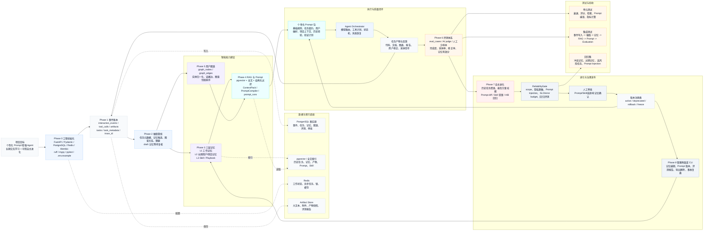

# 个性化 Prompt 增强 Agent 全链路执行计划

## 1. 项目目标

构建一个可持续自我优化的个性化 Prompt 增强 Agent。它通过长期记录和分析用户与 AI 的交互，形成结构化记忆、用户图谱、个人知识库、可复用技能和评测闭环，并在新任务中动态检索复用历史经验，从而提升任务理解、执行质量、风格匹配和长期协作效率。

本计划面向后续执行 AI，可作为项目落地的主任务书。

## 2. MVP 范围

MVP 必须打通完整闭环，但每个模块先做可扩展的最小实现：

1. 全链路事件记录：用户输入、AI 计划摘要、工具调用、输出、反馈。
2. 任务元数据抽取：任务类型、领域、意图、约束、偏好、结果。
3. 三层记忆管理：工作记忆、长期用户/项目记忆、程序化技能记忆。
4. RAG 检索：混合检索历史任务、记忆和 Skill 候选。
5. Prompt 构建：基于当前任务和检索结果生成个性化 Prompt 包。
6. 用户图谱：先用关系表表达节点与边，后续可迁移到图数据库。
7. 评测闭环：少样本人工标注 + AI judge + 采纳率/修正率/完成度指标。
8. 自主进化：生成 Prompt/Skill 候选，先进入人工确认队列，不直接自动发布。

### 2.1 全链路执行图谱

下图将 `plan.md` 的实施路线组织为“三段式施工主线”：先打稳工程和事件账本，再建设记忆、RAG、图谱和 Prompt 编译，最后用评测、自主进化和治理门禁形成可发布、可回滚的闭环。


### 2.2 可编辑执行流程图



## 3. 推荐技术栈

### 3.1 后端

- Python 3.11+。
- FastAPI：HTTP API、管理接口、WebHook 接入。
- Pydantic：Schema、LLM 结构化输出校验。
- SQLAlchemy 2.x：ORM。
- Alembic：数据库迁移。
- LangGraph 或轻量自研 Workflow Engine：Agent 编排。
- Celery/RQ/Arq：异步抽取、聚类、评测任务。MVP 可先用 Arq + Redis。

### 3.2 数据与检索

- PostgreSQL：主库。
- pgvector：向量检索。
- PostgreSQL full-text search：关键词检索。
- Redis：缓存、短期状态、队列。
- 本地文件系统或 S3 兼容对象存储：长文本 artifact、运行日志、评测报告。

### 3.3 AI 能力抽象

- `LLMClient`：统一封装聊天、结构化抽取、评测、总结。
- `EmbeddingClient`：统一封装向量化。
- `RerankerClient`：预留重排能力。
- `PromptCompiler`：拼装 Prompt 组件并记录版本。

### 3.4 测试与质量

- pytest。
- factory_boy 或自定义 fixture：构造交互数据。
- ruff + mypy：代码风格与类型检查。
- eval runner：Prompt 版本回归评测。

### 3.5 可选管理 UI

- Next.js + TypeScript。
- 页面包括：记忆列表、用户图谱、Prompt 版本、评测结果、人工确认队列。

## 4. 推荐代码框架

```text
self-update-prompt-agent/
  README.md
  overview.md
  plan.md
  need.md
  pyproject.toml
  .env.example
  alembic.ini
  app/
    __init__.py
    main.py
    api/
      routes/
        events.py
        memories.py
        prompts.py
        evaluations.py
        graph.py
    core/
      config.py
      logging.py
      security.py
      time.py
    db/
      session.py
      models.py
      migrations/
    schemas/
      events.py
      tasks.py
      memories.py
      graph.py
      prompts.py
      evaluations.py
    ingestion/
      event_writer.py
      artifact_store.py
      feedback_collector.py
    extraction/
      task_metadata_extractor.py
      memory_candidate_extractor.py
      relation_extractor.py
      summarizer.py
    memory/
      manager.py
      working_memory.py
      long_term_memory.py
      skill_memory.py
      decay.py
      conflict_resolution.py
    rag/
      indexer.py
      retriever.py
      hybrid_search.py
      reranker.py
      context_packer.py
    graph/
      builder.py
      repository.py
      queries.py
    prompts/
      registry.py
      compiler.py
      templates/
        base_system.md
        task_runner.md
        memory_context.md
        evaluation_judge.md
    agent/
      orchestrator.py
      tool_protocol.py
      reasoning_policy.py
      run_recorder.py
    evaluation/
      dataset.py
      metrics.py
      ai_judge.py
      runner.py
      reports.py
    evolution/
      clustering.py
      prompt_miner.py
      skill_miner.py
      proposal.py
      rollout.py
    workers/
      tasks.py
    cli/
      main.py
  tests/
    unit/
    integration/
    eval_cases/
  docs/
    annotation_guide.md
    memory_policy.md
    prompt_versioning.md
```

## 5. 核心数据模型

### 5.1 基础实体

```text
users
- id
- display_name
- locale
- timezone
- created_at
- updated_at

workspaces
- id
- user_id
- name
- description
- created_at

projects
- id
- workspace_id
- name
- repo_url
- local_path
- domain
- tech_stack
- created_at
- updated_at

conversations
- id
- user_id
- project_id
- title
- source
- started_at
- ended_at
- summary
```

### 5.2 全链路事件账本

```text
interaction_events
- id
- conversation_id
- parent_event_id
- event_type
  user_message | assistant_message | reasoning_summary | tool_call |
  tool_result | artifact_created | feedback | evaluation | system_note
- actor
  user | assistant | tool | evaluator | system
- content_text
- content_json
- artifact_uri
- visibility
  private | project | reusable | redacted
- occurred_at
- token_count
- cost_estimate
- latency_ms
- trace_id

tool_calls
- id
- event_id
- tool_name
- input_json
- output_summary
- output_artifact_uri
- status
  success | failed | skipped | requires_approval
- error_type
- error_message
- started_at
- finished_at

artifacts
- id
- conversation_id
- project_id
- artifact_type
  code | doc | image | report | patch | eval_report | prompt
- path_or_uri
- content_hash
- summary
- created_at
```

说明：`reasoning_summary` 只保存可展示的推理摘要、计划、假设、验证步骤和失败分析，不保存模型隐藏的完整链式思考。

### 5.3 任务与元数据

```text
tasks
- id
- conversation_id
- project_id
- title
- objective
- task_type
- domain
- status
  planned | running | completed | partial | failed | abandoned
- success_criteria
- started_at
- completed_at

task_metadata
- id
- task_id
- intent
- constraints_json
- user_preferences_json
- tools_used_json
- files_touched_json
- risk_level
- novelty_score
- complexity_score
- confidence_score
- outcome_summary
- correction_count
- accepted_by_user
- extracted_at
```

### 5.4 记忆

```text
memory_items
- id
- user_id
- project_id
- memory_type
  working | episodic | semantic | procedural | preference | skill | warning
- scope
  session | project | user | global
- title
- content
- structured_json
- source_event_ids
- evidence_count
- confidence
- importance
- freshness
- decay_policy
- valid_from
- valid_until
- last_used_at
- created_at
- updated_at

memory_versions
- id
- memory_item_id
- version
- content
- structured_json
- change_reason
- created_at

memory_links
- id
- source_memory_id
- target_memory_id
- relation_type
  supports | contradicts | refines | replaces | derived_from | similar_to
- confidence
- created_at
```

### 5.5 向量索引

```text
vector_chunks
- id
- source_type
  event | memory | artifact | prompt | skill | eval_case
- source_id
- chunk_text
- embedding
- metadata_json
- created_at
```

### 5.6 用户图谱

```text
graph_nodes
- id
- user_id
- node_type
  User | Project | Repository | Domain | Skill | Preference |
  Constraint | Tool | TaskPattern | Artifact | FailureMode | Metric | Concept
- name
- description
- properties_json
- confidence
- created_at
- updated_at

graph_edges
- id
- user_id
- source_node_id
- target_node_id
- edge_type
  prefers | uses | works_on | requires | produced | similar_to |
  derived_from | improves | contradicts | validated_by | decays_after | replaced_by
- properties_json
- confidence
- evidence_event_ids
- created_at
- updated_at
```

### 5.7 Prompt 与进化

```text
prompt_templates
- id
- name
- component_type
  system | task | memory_context | tool_policy | eval | style | safety
- version
- content
- scope
  global | user | project | task_type
- status
  draft | active | deprecated | rejected
- created_at

prompt_runs
- id
- task_id
- prompt_template_ids
- compiled_prompt_hash
- retrieved_memory_ids
- model_policy_json
- output_event_id
- metrics_json
- created_at

evolution_jobs
- id
- job_type
  cluster_tasks | mine_prompt | mine_skill | evaluate_prompt | rollout
- input_json
- output_json
- status
- started_at
- finished_at

evolution_proposals
- id
- proposal_type
  prompt_update | skill_create | skill_update | memory_merge | memory_delete
- title
- rationale
- diff_json
- expected_impact
- eval_result_json
- approval_status
  pending | approved | rejected | rolled_back
- created_at
- reviewed_at
```

### 5.8 评测

```text
eval_cases
- id
- user_id
- project_id
- task_type
- input_context
- expected_behavior
- expected_output_traits
- gold_labels_json
- source_task_id
- difficulty
- created_at

eval_runs
- id
- prompt_template_ids
- eval_case_ids
- model_policy_json
- aggregate_metrics_json
- report_uri
- created_at

eval_results
- id
- eval_run_id
- eval_case_id
- output_text
- scores_json
- judge_rationale
- pass_fail
- created_at

feedback_items
- id
- task_id
- user_id
- feedback_type
  accept | reject | correction | preference | bug | style | missing_context
- content
- structured_json
- created_at
```

## 6. 三层记忆架构

### 6.1 L1 工作记忆

用途：服务当前会话和当前项目，不追求长期稳定。

内容：

- 当前任务目标与约束。
- 已读取、已修改、已验证的文件。
- 当前计划、进行中步骤、阻塞点。
- 用户在本轮刚刚表达的偏好。

生命周期：

- 默认随会话结束进入归档。
- 高价值内容进入 L2 候选。
- 与具体执行过程强绑定的内容保留为 episodic memory。

实现：

- Redis 保存热状态。
- PostgreSQL 保存归档状态。
- 每次 Agent run 都生成工作记忆快照。

### 6.2 L2 长期用户/项目记忆

用途：形成长期个性化上下文和项目知识库。

内容：

- 用户沟通风格：中文/英文、详细程度、是否偏好计划先行。
- 用户执行偏好：自主修改、先问后做、测试要求、Git 行为偏好。
- 技术偏好：框架、数据库、部署方式、代码风格。
- 项目知识：业务目标、架构边界、重要文件、常见坑。
- 稳定需求模式：经常要的文档结构、输出格式、评审标准。

生命周期：

- 每条记忆需要 evidence、confidence、importance、freshness。
- 新证据增强置信度，矛盾证据触发冲突处理。
- 长时间未验证或被项目变更影响的记忆降低 freshness。

### 6.3 L3 程序化技能记忆

用途：把高频、高价值、被验证过的经验变成可执行能力。

内容：

- Prompt 模板片段。
- 项目专属执行 Playbook。
- 用户专属 Skill 草案。
- 特定任务类型的步骤模板。
- 失败模式与修复策略。

生命周期：

- 由多次高质量任务聚类触发生成。
- 通过 eval runner 评测。
- 先进入 `pending`，人工确认后变为 active。
- 有版本号、适用范围、回滚点。

## 7. 交互数据建模与抽取流程

### 7.1 写入流程

1. 用户消息进入 `interaction_events`。
2. Agent 生成任务计划摘要，写入 `reasoning_summary` 类型事件。
3. 每次工具调用写入 `tool_calls` 和对应 `tool_result` 事件。
4. 输出产物写入 `artifacts`。
5. 用户反馈写入 `feedback_items` 和 `interaction_events`。
6. 任务结束后触发异步抽取任务。

### 7.2 抽取流程

1. `TaskMetadataExtractor` 提取任务类型、领域、意图、约束和结果。
2. `MemoryCandidateExtractor` 提取用户偏好、项目事实、可复用经验。
3. `RelationExtractor` 生成图谱节点和边。
4. `Summarizer` 生成会话摘要和任务摘要。
5. `Deduplicator` 合并相似记忆。
6. `ConflictResolver` 标记冲突或替换过期记忆。
7. `Indexer` 将事件、记忆、产物和 Skill 写入向量索引。

### 7.3 元数据标签体系

建议每个任务至少标注：

```text
task_type:
  coding | architecture | documentation | research | review |
  debugging | planning | automation | data_analysis | creative

intent:
  explore | implement | fix | optimize | explain | compare |
  summarize | evaluate | refactor | generate

domain:
  ai_agent | prompt_engineering | backend | frontend | database |
  devops | product | writing | visualization | knowledge_management

quality_target:
  concise | comprehensive | production_ready | beginner_friendly |
  professional | executable | low_risk | fast_iteration

interaction_mode:
  autonomous | ask_first | plan_first | code_first | review_only

outcome:
  accepted | revised | rejected | partial | blocked | unknown
```

## 8. 用户图谱构建方案

### 8.1 图谱目标

图谱用于表达“用户、项目、技能、偏好、工具、任务模式、产物、评测结果”之间的关系，使系统能回答：

- 用户在某类任务中偏好什么做法？
- 哪些项目使用了哪些技术栈？
- 哪些 Prompt 模板在哪些任务类型上效果最好？
- 哪些历史失败模式与当前任务相似？
- 哪些记忆已经过期或被新证据替代？

### 8.2 构建流程

1. 从任务元数据中提取候选节点。
2. 从事件证据中提取关系。
3. 对节点做实体归一化，例如 `PostgreSQL`、`Postgres` 归为同一概念。
4. 对关系打置信度和证据链接。
5. 定期执行图谱清理：合并重复节点、降低过期边权重、处理冲突边。

### 8.3 查询策略

新任务检索时：

1. 找到当前用户、项目、任务类型节点。
2. 展开 1-2 跳邻居：Preference、Skill、FailureMode、PromptTemplate。
3. 对图谱结果与向量检索结果做融合排序。
4. 只注入与当前任务强相关的少量图谱事实。

## 9. RAG 设计

### 9.1 检索对象

- 历史任务摘要。
- 用户长期偏好。
- 项目知识。
- 工具调用经验。
- 失败模式。
- Prompt 模板与 Skill。
- 评测案例和高质量输出。

### 9.2 混合检索评分

建议综合以下分数：

```text
final_score =
  0.30 * semantic_similarity +
  0.20 * keyword_score +
  0.15 * graph_relevance +
  0.15 * confidence +
  0.10 * freshness +
  0.10 * outcome_quality
  - risk_penalty
  - contradiction_penalty
```

### 9.3 上下文打包

`ContextPacker` 输出结构化上下文，而不是散乱文本：

```text
Personalization Context
- Stable user preferences
- Current project facts
- Similar successful tasks
- Relevant failure patterns
- Applicable prompt/skill snippets
- Explicit exclusions or stale memories
```

每条上下文应包含：

- `source_id`
- `source_type`
- `confidence`
- `last_verified_at`
- `why_relevant`

## 10. Prompt 与推理模型策略

### 10.1 Prompt 组件化

Prompt 由以下组件按顺序编译：

1. `base_system`: 通用行为、可靠性、安全边界。
2. `user_profile`: 用户长期偏好和协作方式。
3. `project_context`: 当前项目事实。
4. `task_contract`: 当前任务目标、约束、验收标准。
5. `retrieved_experience`: 相似任务、失败模式、可复用策略。
6. `tool_policy`: 可用工具、审批规则、日志要求。
7. `reasoning_policy`: 计划、验证、风险处理方式。
8. `output_spec`: 输出格式、语言、粒度。

### 10.2 推理策略

建议实现 `ReasoningPolicy`，根据任务复杂度动态选择：

```text
low_complexity:
  直接执行，简短验证，少量上下文注入。

medium_complexity:
  先生成计划摘要，再执行关键步骤，结束后总结。

high_complexity:
  计划 -> 分解 -> 检索历史经验 -> 执行 -> 验证 -> 评测 -> 记忆更新。

high_risk:
  明确风险、需要确认、降低自动化程度、加强审计。
```

系统保存“推理摘要、决策依据、验证步骤”，不要求也不暴露隐藏链式思考。

### 10.3 Prompt 编译输出示例

```text
SYSTEM:
你是用户的长期协作 Agent。你需要遵守安全边界、工具使用规则和项目约束。

USER PROFILE:
- 用户偏好中文输出。
- 用户在架构规划任务中偏好完整、专业、可落地的方案。
- 用户允许在本地仓库中直接创建计划文档。

PROJECT CONTEXT:
- 当前项目处于种子阶段，暂无实现代码。
- 目标是构建 self-update prompt agent。

TASK CONTRACT:
- 先做计划层。
- 输出 overview.md、plan.md、need.md。

RETRIEVED EXPERIENCE:
- 相似任务中，高质量输出通常包含数据模型、RAG、Memory、Evaluation、实施阶段和风险清单。

EXECUTION POLICY:
- 先读项目，再写文档。
- 不编造已有代码。
- 结束前检查文件存在与关键章节。
```

## 11. 自主进化逻辑

### 11.1 进化触发条件

- 同类任务累计达到 N 次。
- 某个 Prompt 模板在评测中持续低于阈值。
- 用户对某类输出反复修正。
- 新项目或新领域出现高频任务。
- 长期记忆出现冲突或过期。

### 11.2 历史最优方案聚类

聚类维度：

- 任务类型。
- 领域。
- 项目。
- 用户反馈结果。
- 工具调用序列。
- 输出结构。
- 修正次数。
- 评测分数。

产出：

- 最优执行步骤。
- 常见失败原因。
- 推荐 Prompt 片段。
- 适用条件。
- 不适用条件。

### 11.3 Prompt 更新流程

1. `PromptMiner` 生成候选 Prompt diff。
2. `EvaluationRunner` 在回归测试集上对比旧版和新版。
3. 指标达标后创建 `evolution_proposals`。
4. 人工确认后写入 `prompt_templates` active 版本。
5. 线上任务记录 Prompt run 结果。
6. 若指标下降，自动回滚到上一稳定版本。

### 11.4 Skill 生成流程

1. 从多次相似高质量任务中提炼步骤。
2. 生成 Skill 草案：适用场景、输入、流程、输出、注意事项。
3. 用测试任务验证 Skill 是否提升完成度和稳定性。
4. 进入人工确认。
5. 通过后注册为 L3 程序化技能记忆。

## 12. 可靠性指标与评测体系

### 12.1 核心指标

```text
adoption_rate:
  用户直接采纳或仅轻微修改的比例。

completion_rate:
  任务达到显式验收标准的比例。

first_pass_success_rate:
  首次输出即满足要求的比例。

correction_rate:
  用户要求重做、补充、修正的次数/任务数。

memory_hit_utility:
  被注入记忆对输出质量的贡献。

context_precision:
  注入上下文中真正相关内容的比例。

context_recall:
  应该使用的关键历史经验被找回的比例。

prompt_bloat_rate:
  Prompt 增长带来的无效 token 比例。

tool_success_rate:
  工具调用成功率与失败恢复效果。

confidence_calibration:
  系统自评置信度与真实结果的一致性。
```

### 12.2 少样本人工标注

每类任务先建立 5-20 个高质量标注样本：

- 用户意图是否理解正确。
- 是否使用了正确项目上下文。
- 输出是否符合用户偏好。
- 是否遗漏关键约束。
- 是否过度使用或误用长期记忆。
- 完成度评分 1-5。
- 风格匹配评分 1-5。

### 12.3 AI 自主评测

AI judge 输入：

- 原始用户请求。
- 当前项目上下文。
- 输出结果。
- 使用的记忆和 Prompt 版本。
- 人工标注标准。

AI judge 输出：

- 各维度评分。
- 是否通过。
- 失败原因。
- 可改进 Prompt 片段。

### 12.4 回归测试集

测试集分类：

- 常规成功路径任务。
- 用户偏好强约束任务。
- 历史相似任务。
- 需要拒绝或谨慎处理的高风险任务。
- 记忆冲突任务。
- 时效性任务。
- 项目上下文缺失任务。

任何 Prompt/Skill 发布前必须跑回归集。

## 13. 时间衰退与置信机制

### 13.1 记忆分数

```text
memory_score =
  importance
  * confidence
  * freshness
  * evidence_strength
  * scope_match
```

### 13.2 衰退策略

- 用户稳定偏好：慢衰退，除非有明确反证。
- 项目技术信息：中等衰退，仓库变化后需重新验证。
- 临时任务约束：快衰退，会话结束后默认不进入长期记忆。
- 工具经验：中等衰退，工具版本变化后降低置信度。
- 时效性事实：按过期时间强制失效。

### 13.3 冲突处理

遇到冲突时不直接覆盖，应：

1. 保留旧证据。
2. 标记冲突关系。
3. 根据时间、来源、用户确认和任务结果计算新置信度。
4. 高影响记忆进入人工确认队列。

## 14. API 设计

### 14.1 事件写入

```text
POST /api/events
GET /api/events/{event_id}
GET /api/conversations/{conversation_id}/events
```

### 14.2 记忆

```text
POST /api/memories/extract
GET /api/memories
PATCH /api/memories/{memory_id}
POST /api/memories/{memory_id}/confirm
POST /api/memories/{memory_id}/reject
```

### 14.3 检索与 Prompt

```text
POST /api/retrieve
POST /api/prompts/compile
GET /api/prompts/templates
POST /api/prompts/templates
POST /api/prompts/runs
```

### 14.4 图谱

```text
GET /api/graph/nodes
GET /api/graph/edges
POST /api/graph/query
POST /api/graph/rebuild
```

### 14.5 评测与进化

```text
POST /api/evaluations/run
GET /api/evaluations/{run_id}
POST /api/evolution/jobs
GET /api/evolution/proposals
POST /api/evolution/proposals/{proposal_id}/approve
POST /api/evolution/proposals/{proposal_id}/reject
```

## 15. 执行阶段计划

### Phase 0: 工程初始化

目标：建立可运行的基础工程。

任务：

- 初始化 Python 项目与依赖管理。
- 配置 FastAPI 服务。
- 配置 PostgreSQL、Redis、Alembic。
- 建立 `app/` 目录结构。
- 添加基础健康检查接口。
- 添加 ruff、mypy、pytest。
- 建立 `.env.example`。

验收：

- 本地服务可启动。
- 测试命令可运行。
- 数据库迁移可执行。

### Phase 1: 事件账本与任务模型

目标：先把交互数据稳定记录下来。

任务：

- 实现 `interaction_events`、`tool_calls`、`artifacts`、`tasks`、`task_metadata` 表。
- 实现事件写入 API。
- 实现 artifact store。
- 实现 conversation/task 创建逻辑。
- 添加事件写入测试。

验收：

- 可以完整记录一次用户请求、AI 输出、工具调用和产物。
- 事件可按 conversation 查询。

### Phase 2: 元数据抽取与记忆候选

目标：从交互记录中提取结构化信号。

任务：

- 实现 `TaskMetadataExtractor`。
- 实现 `MemoryCandidateExtractor`。
- 实现 `Summarizer`。
- 定义结构化输出 schema。
- 实现人工确认前的 `memory_items` draft 状态。
- 添加样例交互 fixture 和抽取测试。

验收：

- 给定一段历史对话，能提取任务类型、领域、偏好、约束、结果。
- 能生成待确认记忆候选。

### Phase 3: 三层记忆管理

目标：让记忆可以被保存、合并、过期、检索。

任务：

- 实现 `WorkingMemoryManager`。
- 实现 `LongTermMemoryManager`。
- 实现 `SkillMemoryManager`。
- 实现 decay policy。
- 实现 conflict resolution。
- 实现 memory versioning。

验收：

- 记忆有版本、置信度、重要性和 freshness。
- 相似记忆可合并，冲突记忆可标记。

### Phase 4: RAG 与 Prompt 编译

目标：新任务开始前能检索并注入相关经验。

任务：

- 实现 `vector_chunks` 表和 pgvector 索引。
- 实现 embedding 写入。
- 实现 hybrid retrieval。
- 实现 graph relevance 占位评分。
- 实现 `ContextPacker`。
- 实现 `PromptCompiler` 和模板注册。
- 记录 `prompt_runs`。

验收：

- 输入新任务，系统能返回相关记忆和历史任务。
- 能生成结构化 Prompt 包。
- Prompt run 能追踪使用了哪些记忆。

### Phase 5: 用户图谱

目标：把用户能力、项目、偏好、技能和任务模式结构化。

任务：

- 实现 `graph_nodes`、`graph_edges`。
- 实现 relation extraction。
- 实现实体归一化。
- 实现基础图查询。
- 将图谱结果接入 RAG 排序。

验收：

- 可以查询用户偏好、项目技术栈、任务模式、技能关系。
- 新任务检索能利用图谱邻居。

### Phase 6: 评测体系

目标：用指标判断 Prompt 和记忆是否真的有效。

任务：

- 实现 `eval_cases`、`eval_runs`、`eval_results`。
- 实现人工标注格式。
- 实现 AI judge。
- 实现核心指标计算。
- 建立第一批 20-50 个回归案例。
- 输出评测报告。

验收：

- 任意 Prompt 版本可跑回归评测。
- 报告包含采纳率、完成度、修正率、记忆有效率等指标。

### Phase 7: 自主进化与 Skill 提炼

目标：从历史最佳实践中生成 Prompt/Skill 候选。

任务：

- 实现任务聚类。
- 实现高质量任务筛选。
- 实现 Prompt diff 生成。
- 实现 Skill 草案生成。
- 实现 evolution proposal。
- 实现人工确认、发布、回滚。

验收：

- 同类高质量任务可生成 Prompt/Skill 候选。
- 候选必须通过评测后才能发布。
- 支持回滚。

### Phase 8: 管理界面或 CLI

目标：让用户可查看、确认、修正系统学到的内容。

任务：

- 实现记忆查看与编辑。
- 实现 Prompt 版本查看。
- 实现进化提案审批。
- 实现评测报告查看。
- 实现用户数据导出与删除。

验收：

- 用户能看到系统为什么这样个性化。
- 用户能删除错误记忆或拒绝不合适的 Skill。

## 16. 测试计划

### 16.1 单元测试

- 数据模型校验。
- 记忆衰退计算。
- 检索评分。
- Prompt 编译。
- 指标计算。

### 16.2 集成测试

- 事件写入 -> 元数据抽取 -> 记忆生成。
- 记忆入库 -> 向量索引 -> RAG 检索。
- Prompt 编译 -> Prompt run 记录。
- 任务完成 -> feedback -> evaluation -> evolution proposal。

### 16.3 评测测试

- 基准 Prompt vs 个性化 Prompt。
- 无记忆 vs 有记忆。
- 错误记忆注入的鲁棒性。
- 过期记忆过滤。
- 冲突记忆处理。

### 16.4 可靠性与边界测试

- 跨用户、跨项目、跨 scope 记忆隔离。
- Prompt Injection 样本：RAG 内容试图覆盖系统规则、工具审批规则或安全边界。
- 敏感信息样本：密钥、token、个人身份信息、第三方隐私数据的写入和日志脱敏。
- 未审批 Prompt/Skill 不能 active。
- 高风险工具调用必须进入审批。
- 发布失败可回滚到上一稳定版本。
- Error budget 耗尽时冻结非紧急 Prompt/Skill 发布。

## 17. 隐私、安全与治理

必须实现：

- 用户数据按 scope 隔离。
- 支持记忆删除、导出、禁用。
- 敏感字段脱敏。
- Prompt 注入防护。
- 高风险行为审批。
- 所有 Prompt 更新可回滚。
- 所有记忆更新保留 evidence。
- 不把私有项目知识用于全局 Prompt，除非用户明确允许。

新增可靠性治理要求：

- 每个任务必须有 `trace_id`，贯穿事件、检索、Prompt 编译、工具调用、评测和进化提案。
- 建立 `ReliabilityGate`，所有 Prompt/Skill/高影响记忆发布前必须通过 scope、敏感信息、Prompt Injection、回归评测、SLO/error budget 检查。
- 引入 SLI/SLO：任务成功率、记忆安全注入率、检索相关率、隐私边界通过率、工具成功率、Prompt 发布安全率。
- 引入事故分级：P0 隐私边界破坏/未审批发布/高风险工具误执行；P1 错误记忆多次注入/Prompt 发布退化；P2 单次低风险失败。
- P0/P1 必须产生复盘、修复项和新的 regression cases。
- 结构化日志默认脱敏，不保存原始敏感内容。

## 18. 执行 AI 的优先级建议

建议按以下顺序执行：

1. 不急于实现复杂图谱，先把事件账本和数据模型做稳。
2. 不急于自动改 Prompt，先做候选提案和人工确认。
3. 不急于做 UI，先用 CLI/API 打通闭环。
4. 不急于引入 Neo4j，先用 PostgreSQL 图节点/边表。
5. 不急于追求大规模评测，先建立高质量小样本基准。
6. 每个阶段都保留测试和可观测性，不允许只堆功能。
7. 不允许绕过发布门禁：active Prompt/Skill 必须来自 approved proposal。
8. 一旦隐私边界或高风险工具边界失败，优先修复可靠性，不继续扩功能。

## 19. 首批开发任务清单

```text
TASK-001 初始化 Python/FastAPI 项目。
TASK-002 添加 PostgreSQL、Redis、Alembic 配置。
TASK-003 实现 interaction_events 数据表与写入 API。
TASK-004 实现 tasks 与 task_metadata 数据表。
TASK-005 实现 tool_calls 与 artifacts 记录。
TASK-006 编写 5 个样例对话 fixture。
TASK-007 实现任务元数据抽取 schema。
TASK-008 实现记忆候选抽取 schema。
TASK-009 实现 memory_items 与 memory_versions。
TASK-010 实现基础 memory manager。
TASK-011 实现 pgvector 向量索引。
TASK-012 实现 hybrid retriever。
TASK-013 实现 PromptCompiler。
TASK-014 实现 prompt_templates 与 prompt_runs。
TASK-015 实现基础 eval_cases 与 AI judge。
TASK-016 实现第一版 eval report。
TASK-017 实现 evolution_proposals。
TASK-018 编写端到端集成测试。
TASK-019 实现 trace_id 与结构化日志。
TASK-020 实现 ReliabilityGate。
TASK-021 实现敏感信息扫描与 redaction。
TASK-022 实现 Prompt Injection regression cases。
TASK-023 实现 SLI/SLO 快照与 error budget 检查。
TASK-024 实现事故记录、复盘模板和回滚建议。
```

## 20. 成功标准

MVP 完成时，应能演示：

1. 输入一段真实任务对话。
2. 系统记录完整交互事件。
3. 系统抽取任务元数据和用户偏好。
4. 系统生成并保存长期记忆候选。
5. 新任务开始时检索相关历史经验。
6. 系统编译个性化 Prompt。
7. 任务结束后计算基础评测指标。
8. 系统提出一个 Prompt 或 Skill 优化候选。
9. 用户能查看、接受或拒绝该候选。
10. 所有 Prompt/Skill 发布前通过 ReliabilityGate。
11. 任意任务可通过 trace_id 复盘事件、检索、Prompt、工具和评测链路。
12. 隐私边界、未审批发布、高风险工具误执行都有自动阻断或复盘流程。

## 21. 关键风险

- 记忆污染：错误记忆被长期使用，导致后续输出偏离用户真实意图。
- Prompt 膨胀：上下文越积越多，成本增加且质量下降。
- 过拟合：只适配历史任务，面对新任务灵活性下降。
- 评测虚高：AI judge 与真实用户满意度不一致。
- 隐私泄漏：项目知识或个人偏好被错误地提升到全局层。
- 自动进化失控：未经验证的 Prompt 更新影响稳定性。
- Prompt Injection：历史上下文或外部资料试图覆盖系统指令和工具规则。
- 可观测性缺失：任务失败后无法定位是检索、记忆、Prompt、工具还是评测问题。
- 发布门禁绕过：候选 Prompt/Skill 未经审批进入 active。

对应措施：

- 记忆必须有证据、置信度、过期策略和回滚。
- RAG 上下文必须有预算和相关性过滤。
- Prompt 版本发布必须经过回归评测。
- 高影响更新必须人工确认。
- 用户可查看和删除系统记忆。
- RAG 内容必须作为“证据”隔离，不能作为系统指令。
- active 状态统一由 ReleaseService/ReliabilityGate 控制。
- P0/P1 事故必须冻结相关发布并补充回归用例。

## 22. 推荐第一版里程碑目标

两周内完成计划层到 MVP 骨架：

- 第 1-2 天：工程初始化与数据库迁移。
- 第 3-4 天：事件账本 API。
- 第 5-6 天：任务元数据抽取。
- 第 7-8 天：记忆候选与三层记忆基础。
- 第 9-10 天：向量索引与 RAG。
- 第 11-12 天：PromptCompiler 与 prompt_runs。
- 第 13 天：基础 eval runner。
- 第 14 天：端到端 demo 与文档补齐。

## 23. 后续扩展方向

- 接入真实 Codex/IDE/浏览器任务流。
- 自动生成个性化 Codex Skill。
- 增加可视化用户图谱。
- 增加多项目隔离与团队模式。
- 引入更强的图数据库和重排模型。
- 支持跨设备同步和本地优先加密存储。
- 基于长期评测结果进行多 Prompt 策略 A/B 测试。
