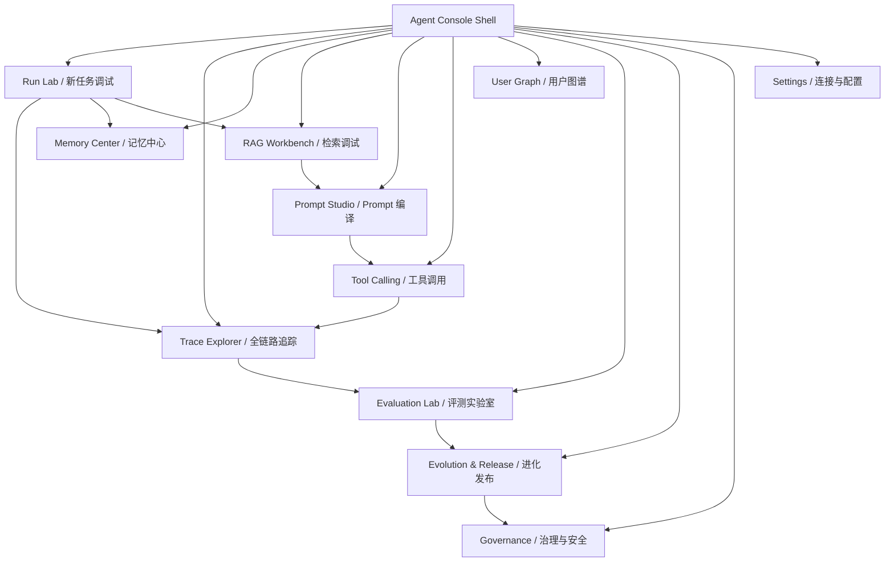
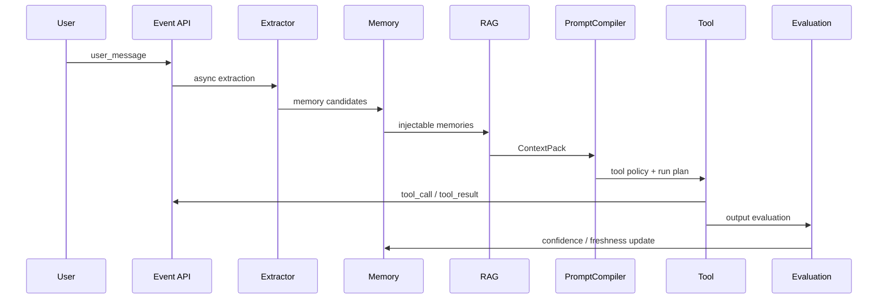

# 个性化 Prompt 增强 Agent 可视化控制台 UI 方案

## 1. 产品定位

本前端不是普通聊天界面，而是面向技术人员、Prompt 工程师和系统维护者的 Agent 调试控制台。它要回答一个核心问题：

> 用户刚刚输入一个 prompt 后，Agent 捕获了什么、理解了什么、调用了什么工具、生成了什么记忆、为什么这些记忆可信、哪些记忆进入了 RAG、最终如何影响 Prompt 和输出质量。

控制台应支持完整观测、人工修正、灰度调试和初步测试。第一版不追求复杂动画，优先保证信息密度、可解释性、可筛选、可追溯和可操作。

## 2. 目标用户

| 用户 | 主要任务 |
| --- | --- |
| Agent 开发者 | 调试事件链路、RAG、PromptCompiler、tool calling、评测和门禁 |
| Prompt 工程师 | 查看 Prompt 组件、上下文注入、历史经验复用、Prompt diff |
| 数据/记忆管理员 | 确认、拒绝、编辑、合并、删除记忆和图谱关系 |
| 评测负责人 | 创建 eval case、运行评测、对比 Prompt 版本、检查回归 |
| 安全/治理负责人 | 检查敏感信息、Prompt Injection、发布门禁、审批和回滚 |

## 3. 总体信息架构



## 4. 全局布局

### 4.1 页面骨架

```text
┌──────────────────────────────────────────────────────────────────────────────┐
│ Top Bar: Project / User / Environment / Trace Search / Run Status            │
├──────────────┬─────────────────────────────────────────────┬────────────────┤
│ Left Nav     │ Main Workspace                              │ Right Inspector│
│              │                                             │                │
│ Run Lab      │ 当前页面主体：表格、时间线、图谱、Diff、表单 │ 选中对象详情   │
│ Trace        │                                             │ JSON / Evidence│
│ Memory       │                                             │ Score / Action │
│ RAG          │                                             │                │
│ Prompt       │                                             │                │
│ Tools        │                                             │                │
│ Graph        │                                             │                │
│ Eval         │                                             │                │
│ Release      │                                             │                │
│ Governance   │                                             │                │
└──────────────┴─────────────────────────────────────────────┴────────────────┘
```

### 4.2 全局控件

- Project/User 切换器：限定当前数据 scope。
- Environment 切换器：local、staging、production，只读展示当前后端。
- Trace Search：按 `trace_id`、conversation、task、memory、artifact 搜索。
- Time Range：最近 15 分钟、1 小时、24 小时、7 天、自定义。
- Privacy Mode：默认隐藏敏感内容，可临时显示脱敏版本。
- Compare Mode：选择两个 prompt run、eval run 或 proposal 做对比。

## 5. 页面 1：Run Lab / 新任务调试

用途：输入一个新 prompt，观察系统从“收到任务”到“生成 Prompt 包”的全过程。

### 5.1 页面分区

| 区域 | 内容 |
| --- | --- |
| 输入区 | 用户 prompt、project、task_type、risk_level、是否模拟工具调用 |
| 任务契约 | objective、constraints、success_criteria、intent、domain、risk |
| 实时链路 | event 写入、metadata 抽取、memory 候选、RAG 检索、Prompt 编译 |
| 记忆结果 | Agent 从本次输入里提取了哪些记忆，进入 draft/active/pending 的原因 |
| Prompt 预览 | 编译后的 Prompt、source_map、token_report |
| 运行动作 | 保存事件、模拟检索、编译 Prompt、运行评测、生成 proposal |

### 5.2 用户看到的关键问题

- 这次输入被识别成什么任务？
- 哪些内容被当成用户偏好或项目事实？
- 哪些记忆被创建为候选？
- 哪些候选因为置信度、scope、敏感性或冲突被拦住？
- 哪些历史记忆被注入 Prompt？
- 注入原因是什么？

### 5.3 推荐组件

- Prompt 输入编辑器：支持 JSON 预览和示例填充。
- Task Contract 面板：结构化字段可手动调整。
- Pipeline Stepper：展示 `capture -> extract -> memory -> retrieve -> pack -> compile -> eval`。
- Memory Candidate Table：显示 `title/type/scope/status/confidence/freshness/evidence_count/reason`。
- ContextPack Preview：按 `stable_user_preferences/project_facts/similar_successes/failure_warnings/applicable_skills/explicit_exclusions` 分区。
- Prompt Diff：当前编译结果 vs 基线 Prompt。

## 6. 页面 2：Trace Explorer / 全链路追踪

用途：以 `trace_id` 为中心复盘一次 Agent run。

### 6.1 主视图



### 6.2 事件时间线

事件以竖向时间线呈现：

- user_message
- reasoning_summary
- tool_call
- tool_result
- artifact_created
- feedback
- evaluation
- system_note

每个事件支持：

- 展开原始 JSON。
- 查看关联 artifact。
- 查看上下游事件。
- 查看是否参与记忆证据。
- 查看是否进入 eval case。

### 6.3 右侧 Inspector

选中任意事件后显示：

- 基础信息：id、trace_id、conversation_id、task_id、actor、event_type、occurred_at。
- 内容：content_text、content_json、artifact_uri。
- 安全：visibility、redaction、sensitivity。
- 关联：source_memory_ids、tool_call_id、artifact_id、eval_result_id。

## 7. 页面 3：Memory Center / 记忆中心

用途：管理 L1/L2/L3 记忆，解释 Agent 到底记住了什么以及为什么可信。

### 7.1 视图结构

| Tab | 内容 |
| --- | --- |
| L1 Working | 当前任务状态、已读文件、已改文件、临时约束、阻塞点 |
| L2 Long-term | 用户偏好、项目事实、技术栈、稳定工作流、失败警告 |
| L3 Skill | Prompt 片段、Playbook、Skill 草案、可执行步骤 |
| Review Queue | pending_review、conflicted、sensitive、cross-scope 记忆 |
| Conflict Map | contradicts、replaces、refines、derived_from 关系 |

### 7.2 记忆列表字段

| 字段 | 说明 |
| --- | --- |
| title | 记忆标题 |
| memory_type | working、episodic、semantic、procedural、preference、skill、warning |
| scope | session、project、user、global |
| status | draft、active、pending_review、conflicted、stale、rejected |
| confidence | 当前置信度 |
| importance | 重要性 |
| freshness | 时间新鲜度 |
| memory_score | 综合注入分 |
| evidence_count | 证据数量 |
| sensitivity_level | public/private/sensitive/secret |
| last_verified_at | 最近验证时间 |
| injectable | 当前任务下是否可注入 |

### 7.3 记忆详情页

详情页采用“证据 + 分数 + 生命周期”布局：

```text
┌──────────────────────────────┬──────────────────────────────┐
│ Memory Content               │ Score Breakdown              │
│ title / content / tags       │ confidence    ███████░       │
│ structured_json              │ importance    ██████░░       │
│ source_event_ids             │ freshness     ████░░░░       │
│                              │ scope_match   ████████       │
├──────────────────────────────┼──────────────────────────────┤
│ Evidence Timeline            │ Actions                      │
│ explicit statement           │ Confirm / Reject / Edit      │
│ user correction              │ Add Evidence / Mark Conflict │
│ task outcome                 │ Archive / Merge / Export     │
└──────────────────────────────┴──────────────────────────────┘
```

### 7.4 必须支持的调试动作

- 手动确认/拒绝记忆。
- 修改 title/content/structured_json。
- 新增证据。
- 标记冲突。
- 合并相似记忆。
- 将 active 记忆降级为 stale。
- 查看“为什么这条记忆没有被注入”。
- 查看“这条记忆最近影响过哪些 Prompt run”。

## 8. 页面 4：RAG Workbench / 检索调试

用途：调试“新任务如何找回历史经验”。

### 8.1 检索输入

- query_text。
- user_id / project_id。
- task_type / domain / intent。
- risk_level。
- scope_policy。
- include/exclude source types。
- max_candidates。
- token_budget。

### 8.2 检索结果表

| 字段 | 说明 |
| --- | --- |
| source_type | memory、task、artifact、prompt、skill、eval_case、graph_node |
| source_id | 来源 ID |
| title | 标题 |
| score_semantic | 语义相似分 |
| score_keyword | 关键词分 |
| score_graph | 图谱相关分 |
| confidence | 来源置信度 |
| freshness | 新鲜度 |
| outcome_quality | 历史结果质量 |
| risk_penalty | 风险惩罚 |
| contradiction_penalty | 冲突惩罚 |
| final_score | 最终排序分 |
| why_relevant | 命中原因 |

### 8.3 ContextPack 预览

按 Prompt 注入分区展示：

- Stable user preferences。
- Current project facts。
- Similar successful tasks。
- Relevant failure patterns。
- Applicable prompt/skill snippets。
- Explicit exclusions or stale memories。
- Dropped items。

每个 item 都应显示：

- source。
- confidence。
- freshness。
- score。
- why_relevant。
- usage_instruction。
- drop_reason。

### 8.4 调试能力

- 切换 scoring 权重并即时重排。
- 查看被过滤候选。
- 对比两次检索结果。
- 固定某条候选进入 Prompt。
- 禁止某条候选进入 Prompt。
- 将误召回样本加入回归集。

## 9. 页面 5：Prompt Studio / Prompt 编译

用途：展示 Prompt 是如何由组件和上下文拼起来的。

### 9.1 页面分区

| 区域 | 内容 |
| --- | --- |
| Component Order | base_system、task_contract、user_profile、project_context、retrieved_experience、tool_policy、reasoning_policy、output_spec |
| Context Source Map | 每段文本来自哪条 memory/task/artifact/skill |
| Token Report | 总预算、已使用、各 section 使用量、被丢弃数量 |
| Compiled Prompt | 最终 Prompt，只读或草稿编辑 |
| Diff View | 当前 Prompt vs 基线 Prompt / 上一版本 Prompt |
| Safety Guard | RAG evidence guard、tool approval、privacy policy |

### 9.2 Prompt 详情字段

- compiled_prompt_hash。
- prompt_template_ids。
- retrieved_memory_ids。
- source_map。
- model_policy。
- warnings。
- estimated_tokens。
- output_spec。

### 9.3 操作

- 编译 Prompt。
- 复制 Prompt。
- 生成 Prompt run。
- 对比 Prompt run。
- 创建 Prompt update proposal。
- 运行回归评测。

## 10. 页面 6：Tool Calling / 工具调用控制台

用途：观察工具调用过程、失败原因、审批策略和产物。

### 10.1 工具调用列表

| 字段 | 说明 |
| --- | --- |
| tool_name | 工具名 |
| status | success、failed、skipped、requires_approval |
| started_at / finished_at | 开始和结束时间 |
| latency_ms | 延迟 |
| trace_id | 关联 trace |
| input_json | 输入 |
| output_summary | 输出摘要 |
| output_artifact_uri | 产物 |
| error_type / error_message | 错误 |
| approval_required | 是否需要审批 |

### 10.2 工具详情

- 输入 JSON。
- 输出摘要。
- 原始结果 artifact。
- 失败重试记录。
- 敏感信息扫描结果。
- 是否影响记忆或评测。
- 是否进入事故复盘。

### 10.3 操作

- 标记工具失败原因。
- 将工具结果保存为 artifact。
- 将成功工具序列提炼为 Skill 候选。
- 将失败工具序列保存为 FailureMode。
- 对高风险工具设置审批策略。

## 11. 页面 7：User Graph / 用户图谱

用途：可视化用户、项目、技能、偏好、工具、失败模式之间的关系。

### 11.1 图谱节点

- User。
- Project。
- Repository。
- Domain。
- Skill。
- Preference。
- Constraint。
- Tool。
- TaskPattern。
- Artifact。
- FailureMode。
- Metric。
- Concept。

### 11.2 图谱边

- prefers。
- uses。
- works_on。
- requires。
- produced。
- similar_to。
- derived_from。
- improves。
- contradicts。
- validated_by。
- decays_after。
- replaced_by。

### 11.3 交互

- 点击节点查看证据来源。
- 展开 1-2 跳邻居。
- 按 confidence 过滤边。
- 合并重复节点。
- 标记错误关系。
- 从图谱节点跳转到 Memory / Trace / RAG 来源。

## 12. 页面 8：Evaluation Lab / 评测实验室

用途：验证个性化 Prompt、记忆注入和工具执行是否真的提高效果。

### 12.1 视图

| Tab | 内容 |
| --- | --- |
| Eval Cases | 手工少样本、历史回归、高风险案例 |
| Eval Runs | 每次运行的 prompt、model、case、结果 |
| Metrics | adoption、completion、correction、memory utility、context precision |
| AI Judge | judge 输入、输出、评分理由、失败原因 |
| A/B Compare | baseline vs personalized、old prompt vs new prompt |

### 12.2 指标卡片

- adoption_rate。
- completion_rate。
- first_pass_success_rate。
- correction_rate。
- memory_hit_utility。
- context_precision。
- context_recall。
- wrong_memory_rate。
- prompt_bloat_rate。
- confidence_calibration。
- tool_success_rate。

### 12.3 操作

- 新增 eval case。
- 从失败 trace 一键生成 eval case。
- 运行 eval suite。
- 查看单 case judge rationale。
- 将失败原因转成 Prompt proposal。

## 13. 页面 9：Evolution & Release / 进化发布

用途：管理 Prompt/Skill/Memory 的进化候选、审批、灰度和回滚。

### 13.1 Proposal 列表字段

| 字段 | 说明 |
| --- | --- |
| proposal_type | prompt_update、skill_create、skill_update、memory_merge、memory_delete |
| title | 标题 |
| expected_impact | 预期收益 |
| approval_status | pending、approved、rejected、rolled_back |
| eval_result | 回归结果 |
| gate_status | passed、requires_approval、blocked |
| rollback_target | 回滚版本 |
| created_at / reviewed_at | 时间 |

### 13.2 Release 详情页

- diff_json。
- rationale。
- source_task_ids。
- evidence_event_ids。
- regression_report。
- SLO snapshot。
- ReliabilityGate checks。
- human approval。
- rollout plan。
- rollback action。

### 13.3 操作

- Approve。
- Reject。
- Request changes。
- Run regression。
- Start canary。
- Freeze release。
- Rollback。
- Create incident review。

## 14. 页面 10：Governance / 治理与安全

用途：统一处理边界、安全、隐私和事故。

### 14.1 分区

- Sensitive Data：密钥、token、个人信息扫描。
- Prompt Injection：命中模式、来源、严重级别。
- Scope Boundary：跨用户、跨项目、跨 global 的异常。
- Approval Queue：高影响记忆、Prompt、Skill、工具调用。
- Incident Review：P0/P1/P2 事故记录、修复项、回归用例。
- Data Control：导出、删除、禁用记忆、审计日志。

### 14.2 关键视图

每条风险记录显示：

- risk_type。
- severity。
- source_id。
- source_type。
- trace_id。
- detected_at。
- blocking_status。
- suggested_action。
- linked_regression_case。

## 15. 数据视图模型

### 15.1 RunTraceView

```ts
type RunTraceView = {
  traceId: string
  conversationId: string
  taskId?: string
  status: "running" | "completed" | "failed" | "blocked"
  userMessage: string
  taskContract: TaskContractView
  events: EventView[]
  memoryCandidates: MemoryView[]
  retrievalCandidates: RetrievalCandidateView[]
  contextPack?: ContextPackView
  compiledPrompt?: PromptRunView
  toolCalls: ToolCallView[]
  evaluation?: EvalResultView
}
```

### 15.2 MemoryView

```ts
type MemoryView = {
  id: string
  title: string
  content: string
  memoryType: string
  scope: string
  status: string
  confidence: number
  importance: number
  freshness: number
  memoryScore: number
  evidenceCount: number
  sensitivityLevel: string
  conflictStatus: string
  sourceEventIds: string[]
  lastVerifiedAt?: string
  injectable: boolean
  injectionReasons: string[]
}
```

### 15.3 RetrievalCandidateView

```ts
type RetrievalCandidateView = {
  sourceType: string
  sourceId: string
  title: string
  contentExcerpt: string
  scoreSemantic: number
  scoreKeyword: number
  scoreGraph: number
  confidence: number
  freshness: number
  outcomeQuality: number
  riskPenalty: number
  contradictionPenalty: number
  finalScore: number
  whyRelevant: string
  usageInstruction?: string
  dropped?: boolean
  dropReason?: string
}
```

### 15.4 ContextPackView

```ts
type ContextPackView = {
  stableUserPreferences: ContextItemView[]
  projectFacts: ContextItemView[]
  similarSuccesses: ContextItemView[]
  failureWarnings: ContextItemView[]
  applicableSkills: ContextItemView[]
  explicitExclusions: ContextItemView[]
  droppedItems: ContextItemView[]
  tokenReport: {
    budgetTotal: number
    usedTotal: number
    usedBySection: Record<string, number>
    droppedCount: number
  }
  sourceMap: Record<string, string>
}
```

## 16. 前端技术建议

第一版建议采用：

- Next.js + React + TypeScript。
- TanStack Query 或同类数据请求层。
- 可视化：React Flow 用于 trace graph / graph view，表格用 TanStack Table 或同类方案。
- 样式：保守的工程控制台风格，浅色优先，低饱和色区分模块。
- API：直接消费 FastAPI REST API，后续可补 OpenAPI codegen。
- 状态：URL query 保存筛选条件，便于复现调试视图。

设计原则：

- 信息密度高，但分区明确。
- 表格优先，卡片只用于指标摘要和详情面板。
- 所有分数都要可展开解释。
- 所有自动决策都要显示原因。
- 所有高影响动作都要确认和可回滚。
- 默认脱敏，支持查看脱敏前后的差异。

## 17. MVP 前端开发阶段

### Phase UI-0：前端工程初始化

- 建立 `frontend/`。
- 配置 TypeScript、路由、API client。
- 建立 AppShell、TopBar、SideNav、InspectorLayout。
- 接入 `/health`。

验收：能打开控制台并显示后端连接状态。

### Phase UI-1：Trace + Event

- Trace Explorer。
- 事件时间线。
- 事件 JSON inspector。
- conversation/task/event 创建和查看。

验收：能看到一次 prompt 输入后写入的完整事件。

### Phase UI-2：Memory Center

- Memory list。
- Memory detail。
- Score breakdown。
- Evidence timeline。
- confirm/reject/edit/add evidence。

验收：能解释“Agent 记住了什么、为什么可信、是否可注入”。

### Phase UI-3：RAG + Prompt

- RAG Workbench。
- Retrieval candidate table。
- ContextPack preview。
- Prompt Studio。
- Prompt diff。

验收：能从一个新任务看到相关记忆如何进入 Prompt。

### Phase UI-4：Tool + Evaluation

- Tool Calling 列表和详情。
- Eval case / eval run。
- 指标面板。
- AI judge rationale。

验收：能判断一次输出质量和工具调用质量。

### Phase UI-5：Evolution + Governance

- Proposal list/detail。
- ReliabilityGate checks。
- Approval queue。
- Incident review。
- Rollback action。

验收：Prompt/Skill 候选发布前能被评测、审批、阻断和回滚。

## 18. 推荐首屏 Dashboard

首屏不做营销式首页，直接进入运维控制台：

```text
┌──────────────────────────────────────────────────────────────────────────────┐
│ Agent Console                                  Project: self-update-prompt   │
├──────────────────────────────┬──────────────────────────┬───────────────────┤
│ Recent Runs                  │ Quality Snapshot         │ Pending Actions   │
│ trace_id / status / time     │ adoption / completion    │ memory review     │
│ prompt hash / eval score     │ correction / tool rate   │ proposal approval │
├──────────────────────────────┴──────────────────────────┴───────────────────┤
│ Run Lab: 输入 prompt，查看 Agent 如何捕获、抽取、记忆、检索、编译和评测       │
├──────────────────────────────────────────────────────────────────────────────┤
│ Live Timeline / Memory Candidates / ContextPack / Compiled Prompt            │
└──────────────────────────────────────────────────────────────────────────────┘
```

## 19. 成功标准

前端 MVP 完成后，技术人员应能演示：

1. 输入一段 prompt。
2. 查看写入的 user_message 和 trace_id。
3. 查看任务契约抽取结果。
4. 查看 Agent 生成了哪些 memory candidate。
5. 查看每条记忆的 evidence、confidence、freshness 和 memory_score。
6. 确认或拒绝一条记忆。
7. 用同一个 prompt 执行 RAG 检索。
8. 查看候选排序、过滤原因和 ContextPack。
9. 查看最终 compiled prompt 和 source_map。
10. 查看工具调用输入、输出、失败原因和 artifact。
11. 运行一次 Evaluation。
12. 生成一个 Prompt/Skill proposal。
13. 查看 ReliabilityGate 为什么通过或阻断。
14. 从任意节点跳回 trace_id 复盘完整链路。

