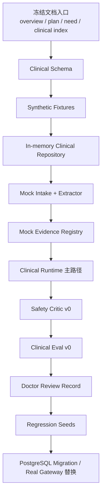

# 病例判读辅助 Agent 项目计划与流程优化

> 文档定位：给后续执行 AI 使用的项目推进规则、阶段门禁和流程优化方案。  
> 适用范围：当前 Phase 0/1，即无真实患者数据、无真实诊断执行、只搭建 mock 闭环。  
> 核心目标：减少返工，先跑通安全闭环，再逐步替换 mock 组件。

---

## 1. 优化后的执行原则

1. 先固定数据契约，再写 runtime。
2. 先用合成病例和 mock evidence 跑通闭环，再接真实模型或真实知识库。
3. 先做安全阻断和审计，再做更强推理能力。
4. 先做离线评测和红线测试，再考虑医生可见界面。
5. 任何真实 PHI/ePHI、真实临床判断、真实系统集成都必须等待 `need.md` 中的合规和专家支持。

一句话：不要从“模型会不会判读”开始做，要从“输入、来源、证据、输出、复核、评测是否可控”开始做。

---

## 2. 优化后的关键路径



关键路径说明：

1. `Clinical Schema` 是所有模块的共同依赖，必须最先做。
2. `Synthetic Fixtures` 是 runtime、RAG、evaluation 的共同测试材料，必须尽早做。
3. `Safety Critic v0` 不应等模型接入后再做，它要先保护 mock runtime。
4. PostgreSQL、真实模型、真实知识库都不是第一天的阻塞项，先用接口和 mock 稳住契约。

---

## 3. 推荐执行顺序

### Step 0：冻结入口

读取顺序：

1. `overview.md`
2. `plan.md`
3. `need.md`
4. `sub-plan-clinical-index.md`
5. `project-process-optimization.md`

交付：

1. 确认所有后续任务只基于 `sub-plan-clinical-*`。
2. 原通用 `sub-plan-*.md` 只作为 scaffold 参考。

### Step 1：Schema 与 fixture

优先文件：

1. `packages/common/clinical_schemas.py`
2. `evals/datasets/synthetic_cases.jsonl`
3. `evals/datasets/safety_red_flags.jsonl`
4. `evals/datasets/rag_grounding_cases.jsonl`

验收：

1. 3-5 条合成病例可被加载。
2. 每条病例有文档、期望实体、问题列表、红旗、禁止输出项。
3. schema 包含 `source_ref`、`confidence`、`review_status`。

### Step 2：Mock clinical repository

优先目标：

1. 暂时复用 `InMemoryRepository` 思路。
2. 新增 clinical in-memory 存储结构。
3. 不急于实现 PostgreSQL repository。

验收：

1. case、document、entity、evidence、draft、review、eval 都能在内存中保存和查询。
2. 可生成 snapshot 用于调试。

### Step 3：Clinical intake 与结构化 mock

优先目标：

1. document classifier v0。
2. section parser v0。
3. entity extractor mock v0。
4. negation/time/subject 的规则化占位。

验收：

1. 合成病例可以输出结构化 JSON。
2. 否定症状和家族史至少有测试保护。
3. 数值、单位、参考范围字段不丢失。

### Step 4：Mock RAG 与 evidence pack

优先目标：

1. mock evidence source registry。
2. evidence chunk fixture。
3. query rewrite contract。
4. ClinicalContextPack。

验收：

1. 每条证据有 `source_id`、`chunk_id`、版本、发布者、适用范围。
2. 未授权、过期、不适用来源被排除。
3. 无证据时 runtime 不能生成鉴别方向。

### Step 5：Clinical runtime 主路径

优先目标：

1. `packages/agent_runtime/clinical_runtime.py`
2. `ClinicalRuntimeRequest`
3. `ClinicalRuntimeResponse`
4. state trace。

验收：

1. 合成病例能跑完整状态机。
2. 每个状态都有 trace。
3. 输出有 `doctor_review_required=true`。

### Step 6：Safety critic v0

优先规则：

1. 阻断“诊断为”。
2. 阻断“建议使用某药/处方/医嘱”。
3. 阻断无证据医学判断。
4. 阻断患者可直接执行建议。
5. 阻断 PHI/ePHI 进入当前阶段。
6. 阻断 prompt injection 生效。

验收：

1. 红线样本全部 fail。
2. fail 后输出安全降级说明，而不是继续生成。

### Step 7：Evaluation v0

优先目标：

1. rule evaluator。
2. extraction evaluator stub。
3. citation evaluator stub。
4. safety evaluator。
5. EvaluationReport。

验收：

1. 每个 eval result 有 score、confidence、rubric_version、target_version。
2. 红线失败能阻断 candidate promote。
3. 失败样本能生成 regression seed。

### Step 8：Doctor review record

优先目标：

1. review schema。
2. review API 或 in-memory action。
3. review 转 eval / memory / clustering input。

验收：

1. accept/edit/reject/mark_danger/needs_more_info 可记录。
2. mark_danger 生成 safety incident。
3. edit 生成 regression candidate。

---

## 4. 并行策略

可以并行：

| 并行方向 | 前置条件 | 注意 |
| --- | --- | --- |
| clinical schema + synthetic fixture | 文档已冻结 | schema 变更要同步 fixture |
| safety critic + eval rubric | 禁止项已明确 | 红线规则先写测试 |
| mock RAG + evidence fixture | EvidenceSource schema 已定 | 不接真实网页 |
| doctor review schema + UI 草图 | Draft schema 已定 | 不做正式病历写回 |
| PostgreSQL migration 草案 + in-memory repo | schema 初稿已定 | migration 不阻塞 mock runtime |

不要并行：

1. schema 未定时并行写 runtime 和 eval，会导致返工。
2. safety critic 未定时接入真实模型，会放大风险。
3. 知识源准入未定时接入真实指南，会产生授权和版本问题。
4. review 流程未定时做聚类进化，会把噪声当规则。

---

## 5. 阶段门禁

### Gate A：进入代码实现

必须满足：

1. `sub-plan-clinical-index.md` 已读。
2. 第一批 synthetic case 已定义。
3. 禁止输出清单已定义。
4. Phase 1 仍限定为 `data_mode=synthetic`。

### Gate B：接入真实模型

必须满足：

1. Safety critic v0 已通过红线测试。
2. Prompt 版本化已实现。
3. 模型调用 trace 已实现。
4. 输出 schema compliance 达标。

### Gate C：接入真实医学知识库

必须满足：

1. EvidenceSource 授权字段已实现。
2. license gate 已实现。
3. effective_until / version filter 已实现。
4. citation evaluator 已实现。

### Gate D：接入脱敏历史病例

必须满足：

1. 数据授权完成。
2. 脱敏策略完成并通过审查。
3. PHI detector 和 audit 可用。
4. IRB/伦理或机构审批路径明确。

### Gate E：进入 shadow mode

必须满足：

1. 离线 gold set 报告通过临床负责人验收。
2. 红旗召回和越权输出达到门槛。
3. 不写回、不患者可见、不影响诊疗流程。
4. safety incident 流程可用。

---

## 6. 执行 AI 工作协议

每个实现任务必须包含：

1. 读取对应 sub-plan。
2. 明确本次修改文件范围。
3. 先写 schema / fixture / test。
4. 再写实现。
5. 更新 trace 或 eval 输出。
6. 更新 `docs/implementation-status.md`。
7. 明确未做事项和下一步。

单个任务建议最大范围：

1. 一个 package。
2. 一个 migration。
3. 一个 eval dataset。
4. 一个集成测试闭环。

避免“大包大揽”一次改十几个模块。

---

## 7. 风险前置优化

| 风险 | 以前可能的做法 | 优化后的做法 |
| --- | --- | --- |
| 先接模型导致越权输出 | 模型先跑，再补安全 | safety critic 和红线测试先行 |
| schema 反复变 | runtime 先写 | schema + fixture 先冻结 |
| RAG 引用不可控 | 直接塞文档进向量库 | EvidenceSource 准入和 license gate 先行 |
| 评测滞后 | 写完再测 | eval fixture 与实现同步 |
| 医生反馈噪声 | 直接变规则 | candidate + eval + clinical review |
| PHI 泄漏 | 日志先收集 | data_mode gate + PHI detector + 最小日志 |
| 计划文件太多 | 执行 AI 不知道读哪个 | clinical index + process optimization 设为入口 |

---

## 8. 里程碑建议

### Milestone 1：文档与契约冻结

交付：

1. clinical schema 初稿。
2. synthetic case fixture。
3. 禁止输出规则。
4. mock evidence fixture。

验收：

1. 不写业务逻辑也能跑 schema 校验。
2. 所有 fixture 标记 synthetic。

### Milestone 2：Mock 闭环

交付：

1. clinical runtime v0。
2. mock extractor。
3. mock RAG。
4. safety critic。
5. eval report。

验收：

1. 单条合成病例跑通完整链路。
2. 红线样本被阻断。

### Milestone 3：可回归闭环

交付：

1. regression cases。
2. version compare。
3. doctor review record。
4. safety incident record。

验收：

1. 修改 prompt 或 policy 可跑回归。
2. review 可转 regression seed。

### Milestone 4：持久化替换

交付：

1. PostgreSQL migration。
2. repository 实现。
3. 数据导入导出。
4. 审计查询。

验收：

1. in-memory 与 PostgreSQL 行为一致。
2. 删除传播测试通过。

---

## 9. 文档维护规则

每次阶段变化必须更新：

1. `docs/implementation-status.md`
2. 对应 `sub-plan-clinical-*.md`
3. eval dataset changelog
4. prompt / policy version note

文档状态建议：

```text
draft
reviewed
implementation_ready
implemented
validated
deprecated
```

当前所有临床子计划状态：`implementation_ready`，但仅限 synthetic/mock Phase 1。

---

## 10. 下一步最优任务

推荐后续执行 AI 的第一批代码任务：

1. 新增 `packages/common/clinical_schemas.py`。
2. 新增 `evals/datasets/synthetic_cases.jsonl`。
3. 新增 `evals/datasets/safety_red_flags.jsonl`。
4. 新增 `packages/governance/clinical_safety.py`。
5. 新增 `packages/agent_runtime/clinical_runtime.py` mock 状态机。

这组任务能最快把项目从“计划层”推进到“可运行 mock 闭环”，而不会触碰真实医疗风险。
