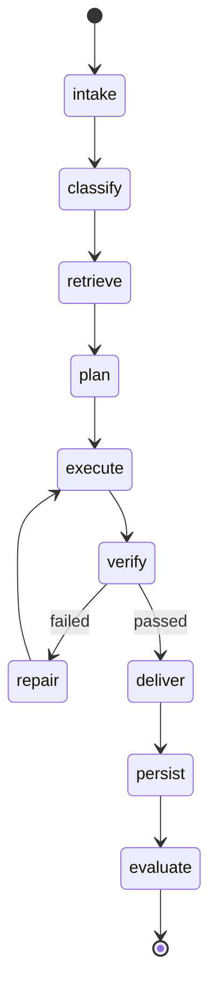

# Sub-plan: Agent Runtime、推理状态机与 Prompt 编排

> 目标：设计可恢复、可追踪、可评测、可个性化的 Agent 执行运行时。Runtime 负责把用户请求、项目上下文、memory、RAG、工具和评测连接成一个可靠工作流。

---

## 1. 模块边界

Agent Runtime 负责：

1. Intake、分类、检索、规划、执行、验证、修复、交付、持久化。
2. 调用 Memory/RAG/Tool/Model/Evaluation 接口。
3. 记录 trace、checkpoint、prompt context。
4. 处理错误、重试、降级和恢复。
5. 支持 episode replay。

Agent Runtime 不负责：

1. 评分公式的最终定义。
2. RAG 底层索引。
3. memory 是否长期激活。
4. prompt 版本是否上线。

## 2. 状态机



节点说明：

1. `intake`：解析用户请求、当前项目、显式要求。
2. `classify`：识别任务类型、风险、工具需求、是否需要外部验证。
3. `retrieve`：调用 Memory/RAG 构建 ContextPack。
4. `plan`：生成执行计划和验收标准。
5. `execute`：调用工具、编辑文件、生成内容。
6. `verify`：critic 检查需求覆盖、格式、事实、风险。
7. `repair`：针对失败项局部修复。
8. `deliver`：输出最终结果。
9. `persist`：写 episode、metadata、memory candidate。
10. `evaluate`：触发即时评测和离线评测任务。

## 3. Runtime 请求结构

```json
{
  "request_id": "req_...",
  "user_id": "user_...",
  "project_id": "proj_...",
  "conversation_id": "conv_...",
  "turn_id": "turn_...",
  "message": "接下来做更具体的sub-plan.md...",
  "attachments": [],
  "runtime_version": {
    "prompt_version": "planning_v3",
    "retrieval_policy": "rag_v2",
    "memory_policy": "memory_v2",
    "tool_policy": "tool_v1"
  },
  "constraints": {
    "max_cost_usd": 2.0,
    "max_runtime_seconds": 1200,
    "allow_network": false
  }
}
```

## 4. 角色组件

| 组件 | 职责 | 输入 | 输出 |
| --- | --- | --- | --- |
| Classifier | 任务分类、风险判断 | user message, project context | TaskProfile |
| Retriever | 构建上下文 | TaskProfile | ContextPack |
| Planner | 生成计划 | TaskProfile, ContextPack | ExecutionPlan |
| Executor | 执行动作 | ExecutionPlan | Artifacts, observations |
| Critic | 验证质量 | outputs, rubric | VerificationReport |
| Repairer | 局部修复 | failed checks | patch/actions |
| MemoryCurator | 提取记忆候选 | episode | MemoryCandidate[] |
| EvaluatorTrigger | 启动评测 | episode | EvalRun |

Planner、Tool Call、MCP 的详细规格见 `sub-plan-planner-tool-mcp.md`。Runtime 只依赖其稳定接口：

1. Planner 输出 `ExecutionPlan` 和 `PlanStep`。
2. Tool Runtime 接收 `ToolSpec` 和 `ToolCallRequest`。
3. MCP Adapter 将 MCP tools/resources/prompts 归一化为内部 ToolSpec、KnowledgeSource 和 PromptTemplateCandidate。
4. Critic 基于 ToolObservation 判断是否 repair。

## 5. Prompt 编排顺序

严格优先级：

1. System / safety policy。
2. 当前用户显式要求。
3. 当前项目约束和文件状态。
4. 当前任务的验收标准。
5. 高置信用户偏好。
6. 历史相似方案。
7. failure case / anti-pattern。
8. 工具和运行环境限制。

规则：

1. 历史偏好不能覆盖当前显式要求。
2. 低置信记忆不能写成确定指令。
3. 外部事实过期时必须重新验证或标注不确定。
4. 每段注入上下文必须保留 source_id。

## 6. ExecutionPlan 契约

```json
{
  "task_type": "planning",
  "goal": "创建多份 sub-plan.md",
  "steps": [
    {
      "id": "s1",
      "name": "读取 plan.md",
      "tool": "filesystem.read",
      "expected_output": "总体架构上下文"
    },
    {
      "id": "s2",
      "name": "创建 sub-plan 文件",
      "tool": "filesystem.write",
      "expected_output": "可执行 Markdown 文档"
    }
  ],
  "acceptance_criteria": [
    "覆盖 memory、数据库、评分、置信衰减、聚类、RAG、评测、runtime",
    "每份文档有执行步骤和验收标准"
  ],
  "risk_level": "medium"
}
```

## 7. Tool Registry

工具 schema 必须包含：

```json
{
  "name": "filesystem.write",
  "description": "创建或修改工作区文件",
  "input_schema": {},
  "output_schema": {},
  "permissions": {
    "requires_user_approval": false,
    "allowed_paths": ["workspace"]
  },
  "timeout_seconds": 30,
  "retry_policy": {
    "max_retries": 1,
    "retryable_errors": ["timeout", "transient_io"]
  },
  "idempotency": {
    "required": true,
    "key_fields": ["request_id", "path", "operation"]
  }
}
```

工具分类：

1. filesystem。
2. shell/code execution。
3. web/search。
4. database。
5. document generation。
6. external apps。
7. evaluation。

补充约束：

1. 每个 tool call 必须关联 `plan_id` 和 `plan_step_id`。
2. side-effect 工具必须声明 `side_effect=true`、风险等级和幂等策略。
3. MCP 工具不得绕过 Tool Registry，必须先归一化为 ToolSpec。
4. MCP resource 不直接进入 prompt，必须先进入 RAG source registry 并通过权限过滤。
5. MCP prompt 只能作为 prompt candidate，不直接覆盖系统 prompt。

## 8. 错误分类与恢复

| 错误 | 检测 | 恢复策略 |
| --- | --- | --- |
| 模型 JSON 格式错误 | parser fail | repair prompt + retry |
| 上下文过长 | token budget exceed | 压缩 RAG / 降低历史上下文 |
| 工具超时 | tool status timeout | retry or fallback |
| 权限不足 | permission denied | 请求用户确认或跳过 |
| 检索冲突 | conflicting context | critic 仲裁或询问用户 |
| 文件冲突 | changed by others | 重新读取再局部修改 |
| 评测失败 | critic fail | repair loop，最多 N 次 |

Repair loop 限制：

1. 默认最多 2 次。
2. 每次 repair 必须针对具体失败项。
3. 超过限制后交付当前最佳结果并说明风险，或请求用户输入。

## 9. Checkpoint 与 Replay

每个状态节点完成后写 checkpoint：

```json
{
  "checkpoint_id": "ckpt_...",
  "run_id": "run_...",
  "state": "verify",
  "inputs": {},
  "outputs": {},
  "context_pack_id": "ctx_...",
  "prompt_version_id": "pv_...",
  "created_at": "2026-07-16T00:00:00Z"
}
```

Replay 用途：

1. 回归测试 prompt 变更。
2. 比较 retrieval policy。
3. 定位失败原因。
4. 复现用户反馈。

Replay 要求：

1. 固定 dataset version。
2. 固定 prompt/policy version。
3. 保存 retrieval snapshot 或可重放 filter。
4. 输出 VersionDiffReport。

## 10. Trace 规范

必须记录：

1. 每个状态节点输入输出摘要。
2. 模型调用参数、token、成本、延迟。
3. 工具调用输入输出、错误、重试。
4. RAG query、召回、过滤、注入项。
5. memory 使用记录。
6. critic 检查项和结果。
7. 最终交付 artifact。

不应记录：

1. 模型隐藏思维链。
2. 明文密钥。
3. 不必要敏感个人信息。

## 11. Runtime 接口

```python
class AgentRuntime:
    def run(self, request: AgentRequest) -> AgentResponse: ...
    def resume(self, checkpoint_id: str) -> AgentResponse: ...
    def replay(self, episode_id: str, version: RuntimeVersion) -> ReplayResult: ...


class RuntimeVersion:
    prompt_version: str
    retrieval_policy_version: str
    memory_policy_version: str
    tool_policy_version: str
    evaluator_version: str
```

## 12. 与其他模块接口

Memory：

1. `retrieve(MemoryQuery)`。
2. `propose_writes(TaskEpisode)`。
3. `commit(MemoryCandidate)`。

RAG：

1. `retrieve(RetrievalQuery)`。
2. `build_context(RetrievalBundle, ContextBudget)`。

Evaluation：

1. `evaluate(TaskEpisode)`。
2. `run_replay(EvalCase, RuntimeVersion)`。

Evolution：

1. Runtime 输出 episode 和 trace。
2. Evolution 产出新的 prompt/policy/skill candidate。

## 13. 实现步骤

1. 定义 AgentRequest / AgentResponse / RuntimeVersion schema。
2. 实现状态机框架。
3. 实现 trace writer。
4. 接入 classifier。
5. 接入 memory/RAG retriever。
6. 实现 prompt builder。
7. 接入 tool registry。
8. 实现 critic/repair loop。
9. 实现 checkpoint/resume。
10. 实现 replay。

## 14. 测试用例

1. 简单写作任务能完成 intake -> deliver。
2. 需要文件编辑的任务能记录 tool trace。
3. RAG 注入上下文被记录到 prompt_context_items。
4. critic 发现缺失项后进入 repair。
5. 工具失败后按策略重试或降级。
6. checkpoint 可恢复执行。
7. 同一 episode 可 replay 并生成对比结果。

## 15. Runtime 指标

1. Task completion rate。
2. Repair loop count。
3. Tool success rate。
4. Average state latency。
5. Cost per task。
6. Context token usage。
7. Trace completeness。
8. Replay reproducibility。

## 16. 验收标准

1. 每次任务都有完整 run trace。
2. 每次输出能追溯 prompt version 和 context source。
3. Repair loop 不会无限循环。
4. Runtime 支持离线 replay。
5. 当前显式要求在 prompt 中优先级最高。
6. 工具调用具备权限、超时和幂等策略。

## 17. 主要风险

1. 状态机过度复杂，MVP 应先实现主路径。
2. Trace 不完整导致无法评测和进化。
3. 历史偏好覆盖当前需求。
4. Repair loop 成本失控。
5. 工具输出未解析导致错误继续传播。
6. Replay 不可复现导致评测失真。
