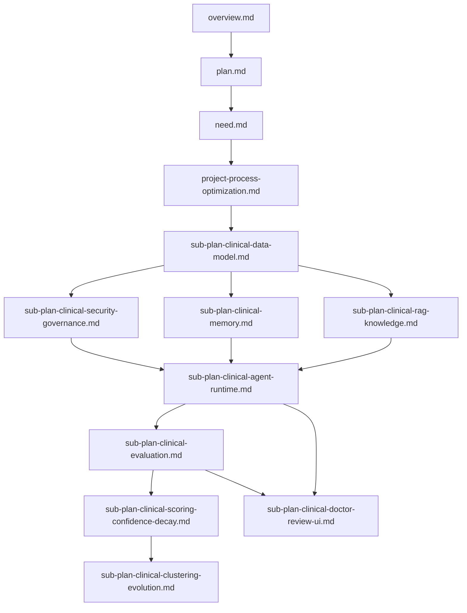

# 病例判读辅助 Agent 子计划索引

> 定位：承接 `overview.md`、`plan.md`、`need.md`，把病例判读辅助 Agent 拆成可并行执行、可验收、可交接的模块级计划。  
> 当前阶段：只做无真实数据的流程框架和 mock 闭环。  
> 强约束：所有输出为医生复核前草案，不做最终诊断、处方、医嘱或患者直接建议。

---

## 1. 推荐阅读顺序



## 2. 子计划文件

| 文件 | 解决的问题 | 第一批交付 |
| --- | --- | --- |
| `project-process-optimization.md` | 项目如何按关键路径、阶段门禁和并行策略推进 | 执行顺序、门禁、里程碑、下一步代码任务 |
| `sub-plan-clinical-data-model.md` | 病例、文档、实体、证据、草案、医生反馈如何落库 | clinical schema、migration 设计、fixture 契约 |
| `sub-plan-clinical-memory.md` | 病例工作记忆、机构记忆、医生反馈记忆如何分层 | clinical memory policy、读写流程、禁止写入清单 |
| `sub-plan-clinical-scoring-confidence-decay.md` | 抽取、证据、草案、红旗、医生反馈如何评分和衰减 | 评分公式、阈值、置信校准、衰减参数 |
| `sub-plan-clinical-rag-knowledge.md` | 医学知识库如何接入、分块、检索、引用和更新 | evidence source registry、RAG policy、引用校验 |
| `sub-plan-clinical-agent-runtime.md` | 临床辅助 Agent 如何从病例输入跑到医生复核 | 状态机、prompt 契约、safety critic、mock pipeline |
| `sub-plan-clinical-evaluation.md` | 如何证明系统安全、可靠、可回归 | gold set、rubric、红线评测、shadow 指标 |
| `sub-plan-clinical-clustering-evolution.md` | 如何从医生反馈中提炼流程改进，但不自动上线 | 聚类对象、候选生成、评测门禁、人工审批 |
| `sub-plan-clinical-security-governance.md` | PHI、权限、审计、监管边界如何控制 | 数据分类、访问控制、删除传播、安全事件 |
| `sub-plan-clinical-doctor-review-ui.md` | 医生如何复核、修改、驳回、标记风险 | 复核台信息架构、操作流、反馈 schema |

## 3. 全局执行原则

1. 先读 `project-process-optimization.md`，再进入模块实现。
2. 先 schema 和 fixture，再 runtime 流程，再真实模型或真实知识库。
3. 所有 clinical 输出必须有 `source_ref`、`confidence`、`review_status`。
4. 所有医学知识必须有 `EvidenceSource` 版本、发布者、适用范围和授权状态。
5. 当前病例事实默认只属于 L1 工作记忆，不得进入跨病例长期记忆。
6. 医生反馈只生成候选规则，不能自动改变线上 prompt、policy 或知识库。
7. 无证据、低置信、资料冲突、高风险场景必须降级到人工复核或拒绝判断。
8. 执行 AI 每完成一个模块，要补测试、trace 和 `docs/implementation-status.md`。

## 4. MVP 切片

Phase 1 只做以下最小闭环：

```text
synthetic_case
  -> clinical document registry
  -> section/entity/timeline mock extraction
  -> problem list
  -> mock evidence retrieval
  -> assessment draft
  -> safety critic
  -> doctor review record
  -> evaluation report
```

MVP 不接真实 PHI、不连接 HIS/EMR/LIS/PACS、不评估真实诊断准确率。

## 5. 官方基线

执行时需要核对最新官方版本：

1. FDA Clinical Decision Support Software guidance: https://www.fda.gov/regulatory-information/search-fda-guidance-documents/clinical-decision-support-software
2. NIST AI RMF: https://www.nist.gov/itl/ai-risk-management-framework
3. HL7 FHIR: https://hl7.org/fhir/
4. HL7 FHIR DiagnosticReport: https://hl7.org/fhir/R4/diagnosticreport.html
5. HHS HIPAA Security Rule: https://www.hhs.gov/hipaa/for-professionals/security/laws-regulations/index.html
6. LOINC: https://loinc.org/
7. SNOMED CT: https://www.snomed.org/
8. DICOM: https://www.dicomstandard.org/
