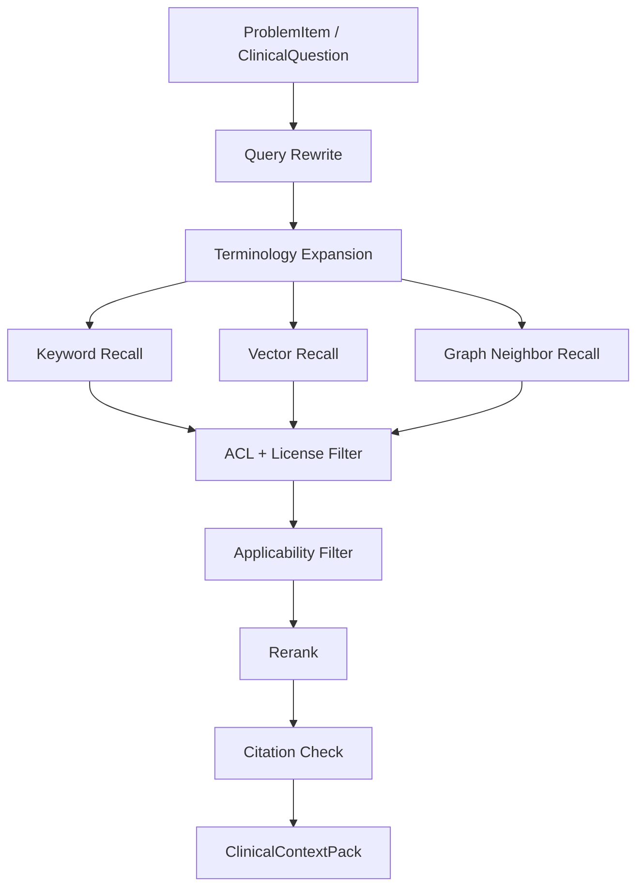

# Sub-plan: 临床 RAG 与医学知识库

> 目标：建立只使用受控、可追溯、可版本化医学知识源的 RAG 系统，为病例辅助草案提供证据，而不是让模型自由编造医学事实。  
> 依据：`plan.md` 第 9 节、`need.md` 第 4 节、HL7/FHIR、LOINC、SNOMED CT 等标准预留。

---

## 1. 模块边界

RAG 负责：

1. 注册医学知识源。
2. 分块、索引、检索、重排。
3. 判断适用人群、地区、科室和版本。
4. 构建 `ClinicalContextPack`。
5. 记录引用和检索 trace。

RAG 不负责：

1. 最终临床判断。
2. 真实知识库授权审批。
3. 医生复核。
4. 自动更新指南结论。

## 2. 知识源分级

| 等级 | 来源 | 使用策略 |
| --- | --- | --- |
| A | 监管文件、药品说明书、权威指南、院内路径 | 可作为主要证据 |
| B | 专业学会共识、教材、系统综述 | 辅助证据 |
| C | 单篇研究、病例报告 | 只作低权重背景 |
| D | 普通网页、论坛、社媒、未审稿内容 | 默认禁用 |

## 3. EvidenceSource 元数据

每个来源必须包含：

1. `source_type`
2. `title`
3. `publisher`
4. `version`
5. `published_at`
6. `effective_until`
7. `region`
8. `specialty`
9. `population`
10. `evidence_level`
11. `license_status`
12. `review_owner`
13. `storage_uri` 或 `url`

没有这些字段的来源不能进入可注入 RAG。

### 3.1 知识源准入字段

每个知识源还必须确认以下使用权限：

1. 是否允许索引。
2. 是否允许向量化。
3. 是否允许进入模型上下文。
4. 是否允许在医生界面展示引用。
5. 是否允许用于离线评测。
6. 是否有地区、机构或科室限制。

## 4. Chunk 策略

| 来源 | 分块方式 | metadata |
| --- | --- | --- |
| 指南 | 章节、推荐条目、适用/排除条件 | recommendation_id、evidence_level、population |
| 药品说明书 | 适应症、禁忌、不良反应、相互作用、特殊人群 | drug_name、section、contraindication |
| 院内路径 | 触发条件、流程节点、升级条件 | pathway_id、department、effective_until |
| 术语体系 | 概念、同义词、父子关系、编码 | code_system、code、aliases |
| 合成病例 | 摘要、问题列表、红旗、医生反馈 | case_type、specialty、gold_label |

## 5. 检索流程



完整数据流：

```text
病例结构化结果
  -> 问题列表 / 风险标签
  -> clinical query rewrite
  -> keyword / vector / terminology / graph recall
  -> ACL / privacy / license filter
  -> version / population / region / specialty filter
  -> rerank
  -> conflict detection
  -> context compression
  -> ClinicalContextPack
  -> safety critic citation check
  -> retrieval trace
```

## 6. Query Rewrite 契约

```json
{
  "clinical_questions": [
    {
      "question": "发热伴咳嗽和白细胞升高需要哪些鉴别方向的证据？",
      "population": "adult",
      "setting": "outpatient",
      "specialty": "respiratory",
      "must_include_source_types": ["guideline", "institutional_pathway"],
      "exclude_source_types": ["unverified_web"]
    }
  ],
  "terminology": {
    "symptoms": ["发热", "咳嗽"],
    "observations": ["白细胞升高"],
    "codes": []
  }
}
```

## 7. ContextPack 契约

```json
{
  "case_id": "case_...",
  "question": "clinical question",
  "items": [
    {
      "evidence_chunk_id": "chunk_...",
      "source_id": "guideline_...",
      "title": "指南标题",
      "version": "2026.1",
      "publisher": "机构",
      "quote": "可引用片段",
      "applicability": {
        "population_match": true,
        "region_match": true,
        "setting_match": true
      },
      "score": 0.88,
      "confidence": 0.82
    }
  ],
  "excluded": [
    {
      "source_id": "old_guideline",
      "reason": "expired"
    }
  ]
}
```

## 8. 引用校验

草案中每条医学事实必须满足：

1. 引用至少一个 evidence chunk。
2. 引用内容支持该事实。
3. 来源未过期。
4. 来源适用当前人群和场景。
5. 引用不是普通网页或未授权来源。

无法满足时，草案只能写“资料/证据不足，需医生判断”。

## 9. 实现步骤

1. 新增 `packages/clinical_rag/source_registry.py`。
2. 新增 `EvidenceSource` / `EvidenceChunk` schema。
3. 编写 mock evidence fixture。
4. 实现 guideline chunker。
5. 复用现有 `RAGService` 的向量/关键词召回。
6. 新增 applicability filter。
7. 新增 citation checker。
8. 输出 `ClinicalContextPack`。
9. 接入 evaluation 的 grounding 指标。

## 10. 测试用例

1. 过期来源被排除。
2. 未授权来源不进入 context pack。
3. 不适用人群来源降权或排除。
4. 草案无引用医学事实被 safety critic 拦截。
5. 同义词扩展能召回相关 guideline chunk。
6. prompt injection 文档内容不被当作知识源指令。

## 11. 验收标准

1. 每个注入证据都有 `source_id`、`version`、`quote`。
2. RAG trace 可复现 query、filter、rank。
3. 默认禁用普通网页。
4. 无证据时不生成鉴别方向。
5. RAG eval 报告包含 citation correctness 和 unsupported claim rate。
6. 未授权、过期、地区或人群不适用来源不得进入证据包。
7. 敏感泄漏和越权检索测试为 0。
8. MVP 可使用 mock 指南；真实知识库接入前必须完成授权和合规确认。

## 12. 风险

| 风险 | 控制 |
| --- | --- |
| 指南过期 | `effective_until` 和更新 SLA |
| 来源无授权 | `license_status` gate |
| 检索相关但不支持结论 | citation checker + faithfulness eval |
| 跨地区指南误用 | region 和 institution filter |
| 知识源被 prompt injection 污染 | 所有来源按不可信文本处理 |
| PHI/ePHI 进入 embedding | 索引前 privacy gate 和 data_mode gate |
| 证据冲突被强行合并 | conflict detection 输出冲突而非合并结论 |
| 上下文过长丢失关键证据 | evidence priority + token budget trace |
