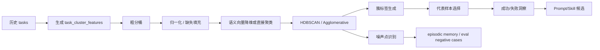
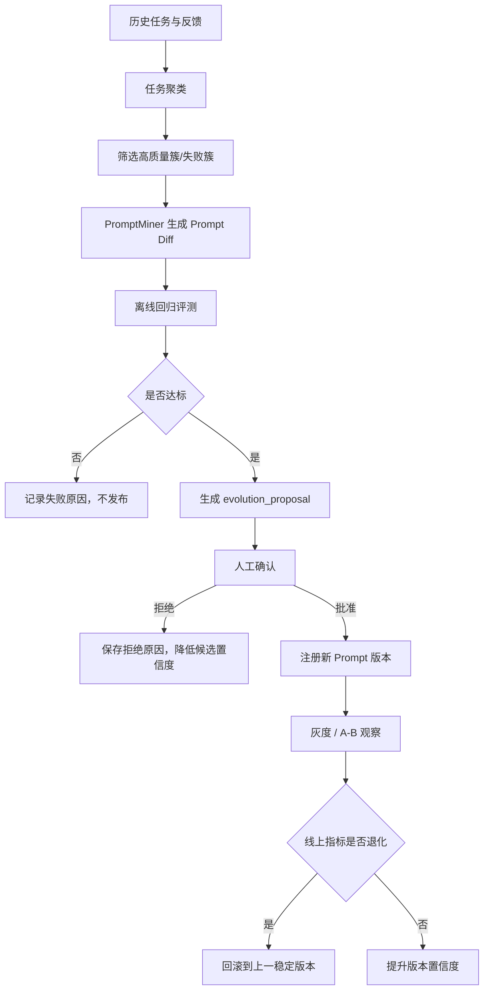
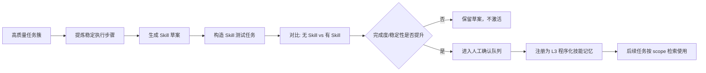

# sub-plan-clustering-evolution: 历史任务聚类与 Prompt/Skill 自进化执行计划

## 1. 目标

从历史任务中发现稳定模式，并将高价值经验沉淀为可评测、可审批、可回滚的 Prompt/Skill 候选。

本计划回答：

- 哪些任务属于同一类需求？
- 哪些历史方案效果最好？
- 哪些失败模式反复出现？
- 哪些模式适合变成 Prompt 规则？
- 哪些流程适合变成个性化 Skill？

## 2. 技术依据

- HDBSCAN 适合簇数量未知、样本密度不均、需要识别噪声点的历史任务聚类。
- scikit-learn 的 KMeans/Agglomerative 可在样本更稳定后补充使用。
- DSPy 的自优化思想提醒我们：Prompt 不应靠手感改，应通过数据集和指标验证。
- 自进化必须采用“候选生成 -> 离线评测 -> 人工审批 -> 灰度 -> 回滚”的受控流程。

## 3. 聚类目标

```text
发现成功模式：
- 高采纳、低修正、高完成度的任务簇。

发现失败模式：
- 反复遗漏约束、误用记忆、工具失败、风格不匹配的任务簇。

生成候选资产：
- Prompt diff。
- Skill 草案。
- 回归测试案例。
- failure warning。
```

## 4. 聚类特征

```text
semantic_features:
- user_request_embedding
- task_summary_embedding
- output_summary_embedding

categorical_features:
- task_type
- intent
- domain
- project_id
- interaction_mode
- risk_level

behavior_features:
- tool_sequence
- files_touched_pattern
- correction_count
- clarification_count
- token_count
- latency_ms

quality_features:
- task_quality_score
- completion_score
- adoption_score
- style_match_score
- eval_score

prompt_features:
- prompt_template_ids
- retrieved_memory_types
- injected_context_count
- prompt_token_count
```

## 5. 聚类算法

### 5.1 粗分桶

```text
bucket_key = user_id + project_id + task_type + domain
```

先分桶可降低误聚类和跨项目污染。

### 5.2 桶内聚类

```text
样本数 < 30:
  规则聚合 + 相似度阈值。

30 <= 样本数 < 500:
  HDBSCAN 或 Agglomerative Clustering。

样本数 >= 500:
  MiniBatchKMeans + HDBSCAN 局部细分。
```

HDBSCAN MVP 参数：

```text
min_cluster_size:
  默认 5，小数据集可降到 3。

min_samples:
  默认 2-5。

metric:
  embedding 归一化后使用 cosine 或 euclidean。

label = -1:
  视为噪声点，不生成 Prompt/Skill 候选，只用于发现新兴任务或负样本。
```

### 5.3 综合相似度

```text
combined_similarity =
  0.50 * semantic_similarity +
  0.20 * metadata_similarity +
  0.15 * tool_sequence_similarity +
  0.15 * output_structure_similarity
```

阈值：

```text
>= 0.78: 同簇。
0.65 - 0.78: 候选邻居，需要二次判断。
< 0.65: 不合并。
```

## 6. 聚类 Pipeline



## 7. 数据结构

```text
task_cluster_features
- id
- task_id
- feature_version
- semantic_embedding
- categorical_json
- behavior_json
- quality_json
- prompt_json
- created_at

task_clusters
- id
- user_id
- project_id
- job_id
- method
  hdbscan | agglomerative | kmeans | rule_based
- feature_version
- cluster_type
  success | failure | mixed | exploratory
- task_type
- domain
- size
- centroid_embedding
- representative_task_ids
- quality_distribution_json
- common_features_json
- status
  draft | reviewed | ignored
- created_at
- updated_at

task_cluster_members
- id
- cluster_id
- task_id
- membership_probability
- outlier_score
- role
  exemplar | normal | weak | noise

cluster_insights
- id
- cluster_id
- insight_type
  success_pattern | failure_pattern | prompt_candidate | skill_candidate | eval_candidate
- title
- content
- evidence_task_ids
- confidence
- created_at

cluster_artifacts
- id
- cluster_id
- artifact_type
  report | prompt_diff | skill_draft | eval_cases
- uri
- summary
- created_at

proposal_reviews
- id
- proposal_id
- decision
  approve | reject | request_changes
- reviewer_note
- created_at

rollout_records
- id
- proposal_id
- target_type
  prompt | skill
- from_version
- to_version
- activated_at
- rolled_back_at
- rollback_reason
```

## 8. 代表样本选择

```text
exemplar_score =
  0.35 * task_quality_score +
  0.20 * adoption_score +
  0.15 * low_correction_score +
  0.15 * memory_utility_score +
  0.10 * recency_score +
  0.05 * clarity_score
```

每个簇至少输出：

```text
- cluster_label
- task_count
- dominant_task_type
- dominant_domain
- common_tools
- common_output_structure
- top_exemplars
- common_failures
- candidate_prompt_rules
- candidate_skills
- confidence
```

## 9. 自进化触发条件

```text
同类高质量任务数 >= 5
或同类失败任务数 >= 3
或某 Prompt 模板连续 3 次低于质量阈值
或用户对同类输出连续 2 次提出相似修正
或某 Skill 候选在回归集上相对基线提升 >= 5%
```

触发原因写入：

```text
evolution_jobs.input_json
- trigger_type
- source_task_ids
- related_cluster_ids
- current_prompt_version
- target_task_type
- expected_improvement
```

## 10. Prompt 自进化



Prompt 候选必须包含：

```text
- 适用任务类型。
- 适用项目或用户范围。
- Prompt diff。
- 生成依据。
- 预期提升指标。
- 回归评测结果。
- 潜在风险。
- 回滚版本。
```

## 11. Skill 自进化



Skill 草案结构：

```text
name:
scope: user | project | task_type
trigger:
applicable_task_types:
required_context:
inputs:
workflow:
tools:
quality_checks:
failure_modes:
output_contract:
examples:
version:
source_task_ids:
confidence:
```

## 12. 离线任务

```text
cluster_tasks_daily:
  每日聚类最近 N 天任务。

cluster_tasks_weekly:
  每周全量重跑，修正簇漂移。

mine_success_patterns:
  从高质量簇提炼成功步骤、输出结构、Prompt 片段。

mine_failure_patterns:
  从低质量簇提炼失败模式、误用记忆、遗漏约束。

build_eval_candidates:
  从代表性簇抽取回归案例候选。

generate_evolution_proposals:
  生成 Prompt/Skill 更新提案。
```

## 13. 执行步骤

1. 实现 `task_cluster_features` 生成。
2. 实现粗分桶和特征归一化。
3. 实现 HDBSCAN/Agglomerative 聚类接口。
4. 实现噪声点识别。
5. 实现 exemplar 选择。
6. 实现 cluster insights 生成。
7. 实现 PromptMiner，输出 Prompt diff。
8. 实现 SkillMiner，输出 Skill 草案。
9. 实现 evolution_proposals。
10. 接入 EvaluationRunner，发布前跑回归。
11. 实现人工审批、active 切换、回滚。

## 14. 验收标准

- 至少 30 条历史或 fixture 任务可完成聚类。
- 聚类结果能区分明显不同任务类型。
- 噪声任务不会被强行归入稳定 Skill。
- 每个高质量簇至少生成一条 success_pattern。
- 每个 Prompt/Skill 候选都能追溯 source_task_ids 和 cluster_id。
- 候选未通过回归和人工审批前不能 active。
- 回滚不丢失旧版本和评测报告。

## 15. 风险处理

| 风险 | 处理 |
| --- | --- |
| 小样本误聚类 | 样本数 < 30 时使用规则聚合，不自动生成 Skill |
| 噪声点污染 Skill | HDBSCAN 噪声点只进入 episodic/negative cases |
| Prompt 过拟合 | 必须跑 cold_start、negative、high_risk 回归集 |
| Skill 过度泛化 | Skill 必须有 trigger、scope、failure_modes |
| 自动进化失控 | 只生成 proposal，人工 approve 后 active |
| 指标退化 | 灰度观察，低于阈值生成 rollback recommendation |

## 16. 参考资料

- HDBSCAN: https://hdbscan.readthedocs.io/en/latest/how_hdbscan_works.html
- scikit-learn clustering: https://scikit-learn.org/stable/modules/clustering.html
- DSPy: https://arxiv.org/abs/2310.03714
- LangSmith evaluation: https://docs.smith.langchain.com/evaluation
