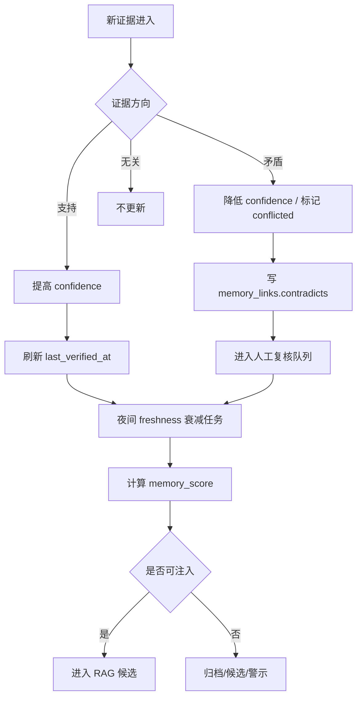

# sub-plan-confidence-decay: 置信度、证据权重与时间衰减执行计划

## 1. 目标

建立一套可解释的置信度与时间衰减机制，用于决定：

- 一条记忆是否可信。
- 一条记忆是否仍然新鲜。
- 一条记忆能否进入检索候选。
- 一条记忆能否注入 Prompt。
- 出现冲突时如何处理旧证据和新证据。

核心目标是防止长期记忆污染，同时避免稳定用户偏好被过快遗忘。

## 2. 技术依据

- 长期 Agent 记忆必须处理 stale、conflict、scope、evidence 等问题。
- 概率校准与 Brier/reliability 思路提醒我们：系统的 confidence 应与真实有效性接近，而不是只作为装饰字段。
- 时间衰减适合用半衰期模型表达“越久未验证，越不该被默认注入”。

## 3. 证据类型权重

```text
explicit_user_statement: 1.00
user_correction: 0.95
repeated_behavior: 0.85
task_outcome_success: 0.75
artifact_evidence: 0.70
tool_result_evidence: 0.65
ai_inference_from_context: 0.45
weak_signal: 0.25
contradiction: -0.80
```

证据强度：

```text
evidence_strength =
  min(1.0, sum(evidence_weight * source_weight * outcome_weight))
```

默认 source_weight：

```text
用户明确输入: 1.0
用户反馈: 1.0
当前仓库文件: 0.8
工具结果: 0.75
AI 摘要: 0.55
AI 推断: 0.40
```

## 4. 初始置信度

```text
用户明确表达的偏好: 0.75
用户明确纠正后的偏好: 0.85
单次任务中推断出的偏好: 0.45
项目文件中提取的事实: 0.65
工具调用经验: 0.60
多次高质量任务归纳出的流程: 0.70
AI 单独推断且无用户确认: 0.35
```

首次创建公式：

```text
confidence_initial =
  0.50 * evidence_weight +
  0.20 * extraction_confidence +
  0.20 * source_authority +
  0.10 * task_quality_score
```

## 5. 置信更新公式

### 5.1 支持性证据

```text
support_strength = evidence_weight * source_weight * outcome_weight
confidence_new = 1 - (1 - confidence_old) * (1 - support_strength)
```

### 5.2 矛盾证据

```text
contradiction_strength = abs(evidence_weight) * source_weight * recency_weight
confidence_new = confidence_old * (1 - contradiction_strength)
```

### 5.3 MVP 增量公式

若第一版不想引入复杂组合，可先使用：

```text
new_confidence =
  clamp(
    old_confidence
    + support_delta
    - contradiction_delta
    + confirmation_bonus
    + outcome_bonus
    - stale_penalty,
    0,
    1
  )
```

建议：

```text
support_delta = min(0.05 * high_quality_support_count, 0.20)
contradiction_delta = min(0.08 * contradiction_count, 0.30)
confirmation_bonus = 0.15
outcome_bonus = 0.05
stale_penalty = 0.03-0.20
```

## 6. 时间衰减

使用半衰期：

```text
freshness = exp(-ln(2) * age_days / half_life_days)
```

默认半衰期：

```text
session_constraint: 1 天
temporary_project_context: 14 天
tool_behavior: 45 天
project_fact: 90 天
user_style_preference: 180 天
stable_user_preference: 365 天
procedural_skill: 180 天，但成功使用后刷新
time_sensitive_fact: 到 valid_until 后强制归零
```

## 7. 记忆最终分

```text
memory_score =
  0.25 * confidence +
  0.20 * importance +
  0.20 * freshness +
  0.15 * scope_match +
  0.10 * specificity +
  0.10 * usage_utility
  - risk_penalty
  - contradiction_penalty
```

注入阈值：

```text
memory_score >= 0.72:
  可直接作为 Prompt 上下文候选。

0.50 <= memory_score < 0.72:
  只作为候选展示或低权重检索结果。

memory_score < 0.50:
  不注入。

status in [conflicted, stale, archived, rejected]:
  默认不注入，只可作为 warning/exclusion。
```

执行侧强门槛：

```text
普通任务 inject if:
  memory_score >= 0.45
  and confidence >= 0.60
  and freshness >= 0.35
  and scope_match >= 0.80
  and contradiction_status != unresolved_high_impact

高风险任务 inject if:
  memory_score >= 0.65
  and confidence >= 0.75
  and freshness >= 0.50
  and scope_match = 1.0
  and no unresolved contradiction
```

AI-only 证据限制：

```text
仅由 AI 推断支持的记忆，confidence 最高只能到 0.55。
超过注入门槛必须有用户确认、任务采纳、工具证据或项目文件证据。
```

## 8. 更新流程



## 9. 置信变化日志

每次置信变化必须记录：

```text
confidence_update_log
- id
- memory_item_id
- old_confidence
- new_confidence
- old_freshness
- new_freshness
- evidence_event_id
- update_reason
- updated_by
  system | user | evaluator
- created_at
```

若不新增表，至少写入 `memory_versions.change_reason`。

## 10. 执行步骤

1. 实现 `EvidenceWeight` 枚举与配置。
2. 实现 `compute_initial_confidence()`。
3. 实现 `apply_supporting_evidence()`。
4. 实现 `apply_contradicting_evidence()`。
5. 实现 `compute_freshness()`。
6. 实现 `compute_memory_score()`。
7. 实现每日 `decay_memories` 任务。
8. 在 RAG 检索前强制计算或读取最新 memory_score。
9. 出现矛盾证据时创建 review item。
10. 编写测试：半衰期、用户确认、反证、过期、成功使用刷新。

## 11. 验收标准

- 每条 active memory 都能展示 confidence、freshness、memory_score。
- 用户明确确认能显著提高 confidence。
- 用户明确否定能显著降低 confidence 并触发冲突处理。
- 超过半衰期后 freshness 约下降到 0.5。
- time_sensitive_fact 到期后 freshness=0。
- 低于阈值的记忆不会注入 Prompt。
- 所有置信变化可追溯。

## 12. 风险处理

| 风险 | 处理 |
| --- | --- |
| AI 推断被过度相信 | AI inference 初始置信低，必须有后续证据增强 |
| 稳定偏好被过快遗忘 | 稳定偏好使用长半衰期 |
| 项目事实过期仍使用 | 项目事实中等半衰期，仓库变化触发重评 |
| 冲突被覆盖 | 写 contradicts link，进入人工复核 |
| 置信度失真 | 用人工样本和真实采纳结果定期校准 |

## 13. 参考资料

- MemGPT: https://arxiv.org/abs/2310.08560
- Letta archival memory: https://docs.letta.com/guides/core-concepts/memory/archival-memory/
- scikit-learn probability calibration: https://scikit-learn.org/stable/modules/calibration.html
