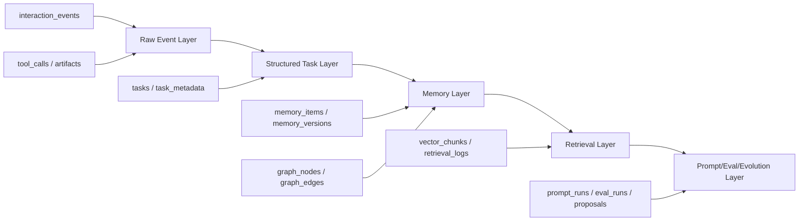
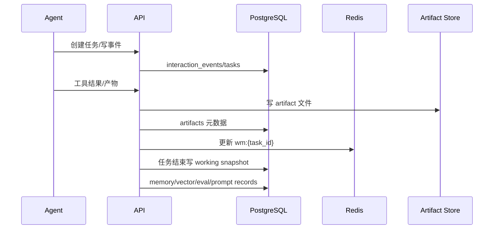

# sub-plan-database: 数据库与存储执行计划

## 1. 目标

建立本地优先的数据底座，用于支撑事件账本、记忆、向量检索、图谱、Prompt 版本、评测、进化提案和审批。

默认技术栈：

- PostgreSQL：唯一事实源。
- pgvector：向量检索。
- PostgreSQL full-text search：关键词检索。
- Redis：短期工作记忆、缓存、队列、幂等锁。
- 本地 artifact 目录：长文本、报告、产物快照。

## 2. 技术依据

- PostgreSQL 能同时承载事务、JSONB、全文检索、关系查询和审计需求。
- pgvector 支持 HNSW/IVFFlat 索引，适合 MVP 阶段把向量检索留在主库内。
- PostgreSQL full-text search 可补足工程任务中的精确关键词、错误码、文件名检索。
- Redis 适合保存可重建短期状态，不应作为事实源。

## 3. 存储分层



## 4. 表批次

### Batch A: 基础账本

```text
users
workspaces
projects
conversations
tasks
interaction_events
tool_calls
artifacts
```

验收：

- 能记录一次完整用户任务。
- `conversation_id` 串起用户消息、AI 输出、工具调用和反馈。
- `trace_id` 支持跨异步任务追踪。

### Batch B: 记忆与反馈

```text
task_metadata
memory_items
memory_versions
memory_links
memory_review_queue
feedback_items
```

验收：

- 任务结束后能生成元数据和记忆候选。
- 记忆可版本化，可冲突标记，可人工复核。

### Batch C: 检索与图谱

```text
vector_chunks
graph_nodes
graph_edges
retrieval_logs
retrieval_candidates
context_packs
```

验收：

- 向量、全文、图谱候选可独立检索。
- 每次检索能记录候选、入选、丢弃原因和分数。

### Batch D: Prompt、评测、进化

```text
prompt_templates
prompt_runs
eval_cases
eval_runs
eval_results
task_cluster_features
task_clusters
cluster_insights
evolution_jobs
evolution_proposals
skill_items
skill_versions
approval_items
reliability_events
incidents
slo_snapshots
```

验收：

- Prompt 编译结果可复现。
- Eval run 可绑定 Prompt 版本。
- Evolution proposal 可审批、发布和回滚。

## 5. 关键表结构

### 5.1 vector_chunks

```text
vector_chunks
- id
- source_type
  event | memory | artifact | prompt | skill | eval_case | cluster
- source_id
- user_id
- project_id
- chunk_text
- chunk_hash
- embedding
- embedding_dim
- metadata_json
- visibility
  private | project | reusable | redacted
- token_count
- embedding_model
- status
  active | stale | deleted
- created_at
- updated_at
```

### 5.2 retrieval_logs

```text
retrieval_logs
- id
- task_id
- query_text
- query_embedding_model
- filters_json
- candidate_ids_json
- selected_ids_json
- scores_json
- dropped_items_json
- token_budget
- created_at
```

### 5.3 retrieval_candidates

```text
retrieval_candidates
- id
- retrieval_log_id
- source_type
- source_id
- semantic_rank
- keyword_rank
- graph_rank
- rrf_score
- final_score
- filter_reasons_json
- selected
- created_at
```

### 5.4 context_packs

```text
context_packs
- id
- task_id
- prompt_run_id
- pack_json
- source_ids_json
- total_tokens
- dropped_items_json
- created_at
```

### 5.5 approval_items

```text
approval_items
- id
- item_type
  prompt_template | skill | memory | scope_promotion | memory_delete
- item_id
- proposal_id
- risk_level
  low | medium | high
- approval_status
  pending | approved | rejected | rolled_back
- reviewer_note
- created_at
- reviewed_at
```

### 5.6 reliability_events

```text
reliability_events
- id
- trace_id
- task_id
- event_type
  boundary_violation | wrong_memory | prompt_injection_attempt |
  release_gate_failed | eval_regression | tool_failure | rollback
- severity
  p0 | p1 | p2 | info
- component
- source_ids_json
- detail_json
- created_at
```

### 5.7 incidents

```text
incidents
- id
- severity
  p0 | p1 | p2
- title
- affected_task_ids
- root_cause
- failed_boundary
- why_eval_did_not_catch
- rollback_action
- memory_cleanup_json
- new_regression_case_ids
- owner
- status
  open | mitigated | closed
- created_at
- closed_at
```

### 5.8 slo_snapshots

```text
slo_snapshots
- id
- window_start
- window_end
- task_success_sli
- memory_safety_sli
- retrieval_precision_sli
- prompt_release_safety_sli
- tool_reliability_sli
- privacy_boundary_sli
- error_budget_json
- created_at
```

## 6. 索引计划

```text
interaction_events:
- idx_events_conversation_time(conversation_id, occurred_at)
- idx_events_trace_id(trace_id)
- idx_events_type(event_type)

tasks:
- idx_tasks_project_status(project_id, status)
- idx_tasks_type_domain(task_type, domain)

memory_items:
- idx_memory_user_scope(user_id, scope)
- idx_memory_project_type(project_id, memory_type)
- idx_memory_status(status)
- idx_memory_quality(confidence, freshness, importance)
- gin_memory_structured_json(structured_json)

vector_chunks:
- hnsw_vector_embedding(embedding vector_cosine_ops)
- idx_vector_source(source_type, source_id)
- idx_vector_user_project(user_id, project_id)
- gin_vector_metadata(metadata_json)
- fts_chunk_text(to_tsvector('simple', chunk_text))

graph_edges:
- idx_graph_source(source_node_id, edge_type)
- idx_graph_target(target_node_id, edge_type)
- idx_graph_user_type(user_id, edge_type)
```

## 7. Redis Key 规范

```text
wm:{task_id}
  当前任务工作记忆。

lock:{job_name}:{scope_id}
  异步任务幂等锁。

cache:retrieval:{query_hash}
  短期检索缓存。

queue:{name}
  异步任务队列。

rate:{provider}:{user_id}
  模型或工具调用限速计数。
```

规则：

- Redis 数据必须可重建。
- 所有 key 必须有 TTL 或清理策略。
- 敏感内容写入 Redis 前必须脱敏或按 scope 限制。

## 8. 数据流



## 9. 执行步骤

1. 初始化 PostgreSQL、pgvector、Redis 和 artifact 目录。
2. 配置 Alembic，建立 baseline migration。
3. 实现基础账本表和 Repository 层。
4. 实现 artifact store：写文件、算 hash、落 metadata。
5. 实现 memory、vector、graph、prompt、eval、evolution 表。
6. 添加 HNSW/全文/JSONB/常用过滤索引。
7. 实现 Redis key helper 和幂等锁。
8. 实现软删除策略：memory 删除后 vector chunk 置 `deleted`。
9. 实现数据导出与删除接口。
10. 编写空库迁移测试、索引存在测试、级联删除测试。

## 10. 验收标准

- 空库可一键迁移完成。
- 本地服务可连接 PostgreSQL 与 Redis。
- 能插入并查询 vector chunk。
- 能对 `chunk_text` 做全文检索。
- 能记录 retrieval log 和 context pack。
- 任意 Prompt/Skill 发布都能追溯 approval item。
- 删除用户数据时，私有 memory、graph、vector、prompt_runs 引用可清理。
- 任意 P0/P1/P2 可靠性事件可落库，并关联 trace_id。
- SLO 快照可按日生成，并能触发发布冻结。

## 11. 风险处理

| 风险 | 处理 |
| --- | --- |
| 向量维度变化 | embedding_model 与维度绑定，新模型使用新索引批次 |
| Redis 丢失 | Redis 只存热状态，必要状态必须回写 PostgreSQL |
| artifact 丢失 | 通过 content_hash 和健康检查发现，检索时降级跳过 |
| 迁移失败 | 每次迁移保持小步，保留备份和回滚说明 |
| 数据越权 | 所有查询带 user_id/scope/project_id 过滤 |
| Prompt/Skill 误发布 | active 状态必须依赖 approval_items.approved |

## 12. 参考资料

- pgvector: https://github.com/pgvector/pgvector
- PostgreSQL full text search: https://www.postgresql.org/docs/current/textsearch.html
- PostgreSQL JSON types: https://www.postgresql.org/docs/current/datatype-json.html
- Redis documentation: https://redis.io/docs/latest/
