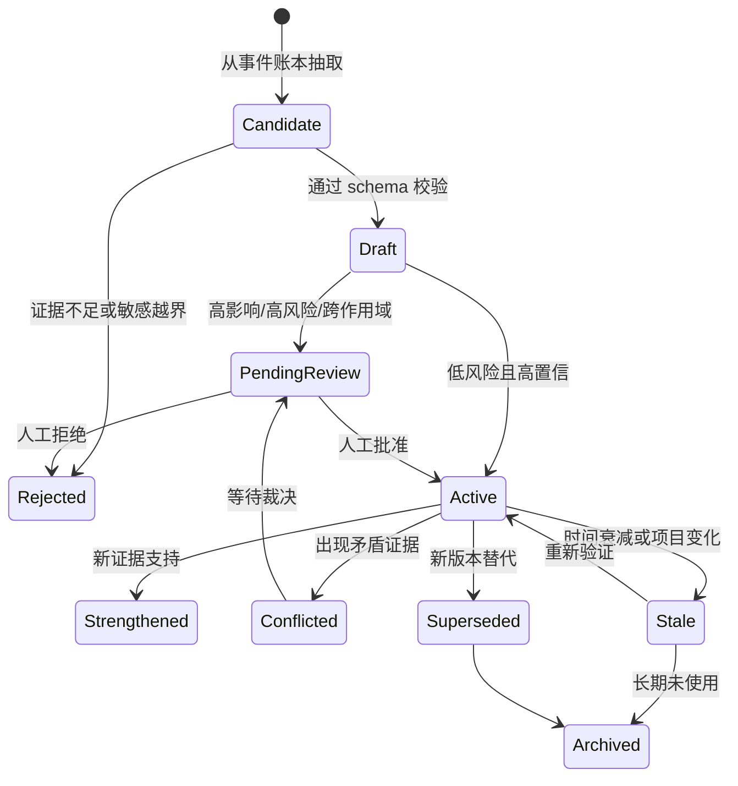
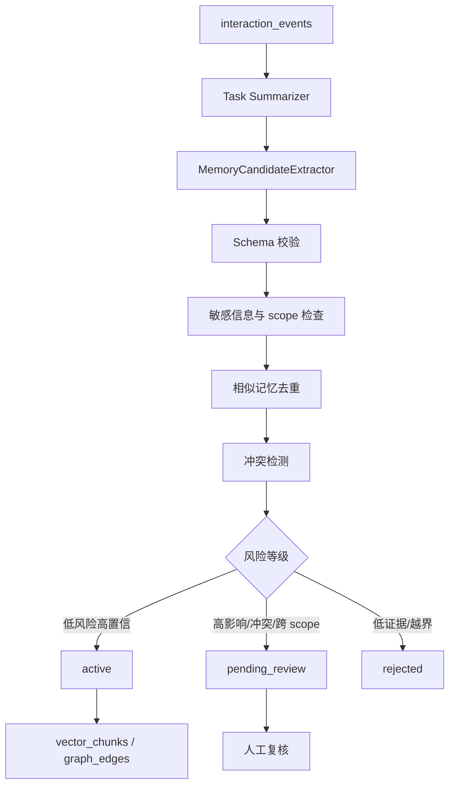

# sub-plan-memory: 三层记忆系统执行计划

## 1. 目标

构建可追踪、可检索、可衰减、可冲突处理、可人工治理的三层记忆系统：

- L1 Working Memory：当前任务与会话的短期工作状态。
- L2 Long-term Memory：跨任务、跨会话的用户偏好、项目事实、历史经验。
- L3 Procedural Skill Memory：可复用的流程、Prompt 组件、项目 Playbook 和个性化 Skill。

记忆系统的核心不是“存更多”，而是“只把有证据、有作用域、有置信度、有生命周期的内容用于新任务”。

## 2. 技术依据

- MemGPT 将 LLM 上下文限制类比为操作系统内存层级，强调需要外部长期存储与上下文内短期记忆协同。
- Letta 的 memory blocks 与 archival memory 证明长期 Agent 需要可编辑、可持久、可检索的记忆单元。
- 本项目的长期个性化需要把临时任务状态、用户/项目长期事实、程序化 Skill 分开，否则容易造成 Prompt 膨胀和记忆污染。

## 3. 记忆分层

```text
L1 Working Memory
- 生命周期：当前任务/会话。
- 典型内容：目标、约束、已读文件、执行进度、临时偏好。
- 存储：Redis 热状态 + PostgreSQL 快照。

L2 Long-term Memory
- 生命周期：跨会话。
- 典型内容：用户偏好、项目事实、工具经验、失败模式。
- 存储：PostgreSQL memory_items + vector_chunks + graph_edges。

L3 Procedural Skill Memory
- 生命周期：版本化长期资产。
- 典型内容：Prompt 模板、执行 Playbook、Skill 草案。
- 存储：skill_items / prompt_templates / evolution_proposals。
```

## 4. 生命周期流程



## 5. 数据结构

### 5.1 memory_items

```text
memory_items
- id
- user_id
- workspace_id
- project_id
- conversation_id
- task_id
- memory_type
  working | episodic | semantic | procedural | preference | skill | warning
- scope
  session | project | user | global
- status
  candidate | draft | pending_review | active | conflicted | stale |
  archived | rejected | superseded
- title
- content
- structured_json
- source_event_ids
- source_artifact_ids
- evidence_json
- evidence_count
- confidence
- importance
- freshness
- sensitivity_level
  public | private | sensitive | secret
- decay_policy
  none | slow | medium | fast | expires_at
- valid_from
- valid_until
- last_verified_at
- last_used_at
- usage_count
- created_at
- updated_at
```

### 5.2 evidence_json

```text
[
  {
    "event_id": "...",
    "evidence_type": "explicit_user_statement | repeated_behavior | task_outcome | artifact_evidence | ai_inference",
    "quote_or_summary": "...",
    "source_weight": 0.0,
    "observed_at": "datetime"
  }
]
```

### 5.3 memory_versions

```text
memory_versions
- id
- memory_item_id
- version
- content
- structured_json
- quality_json
- change_reason
- changed_by
  system | user | evaluator
- created_at
```

### 5.4 memory_links

```text
memory_links
- id
- source_memory_id
- target_memory_id
- relation_type
  supports | contradicts | refines | replaces | derived_from | similar_to
- confidence
- evidence_event_ids
- created_at
```

### 5.5 memory_review_queue

```text
memory_review_queue
- id
- memory_item_id
- review_type
  create | update | merge | delete | promote_scope | publish_skill
- reason
- risk_level
  low | medium | high
- proposed_by
  system | user | evaluator
- approval_status
  pending | approved | rejected | rolled_back
- reviewer_note
- created_at
- reviewed_at
```

## 6. 抽取流程



## 7. 执行步骤

1. 定义 `MemoryCandidate` Pydantic schema，包含 `memory_type`、`scope`、`content`、`evidence_json`、`confidence_initial`。
2. 实现 `WorkingMemoryManager`：
   - `set_task_state(task_id, state)`。
   - `append_observation(task_id, observation)`。
   - `snapshot(task_id)`。
3. 任务结束后将 L1 快照归档为 `episodic` 记忆。
4. 实现 `MemoryCandidateExtractor`，从用户输入、AI 摘要、工具结果、用户反馈中抽取候选。
5. 实现 `MemoryDeduplicator`：
   - 同 scope、同 type 下做标题关键词相似。
   - 对 content 做 embedding 相似。
   - 相似且同义则合并 evidence。
6. 实现 `MemoryConflictResolver`：
   - 发现矛盾事实时写 `memory_links.contradicts`。
   - 不直接覆盖 active 记忆。
7. 实现 `MemoryReviewService`：
   - 创建复核项。
   - 批准后将记忆置为 active。
   - 拒绝后记录理由。
8. 实现 `MemoryIndexer`：
   - active 记忆写入 `vector_chunks`。
   - preference/project_fact/skill 写入图谱候选。
9. 实现删除、导出、禁用接口。
10. 编写测试：候选抽取、去重、冲突、人工批准、删除、过期不注入。

## 8. 自动激活与人工确认规则

```text
可自动激活：
- scope = session 或 project。
- confidence >= 0.78。
- risk <= 0.25。
- evidence_type 包含 explicit_user_statement 或 repeated_behavior。
- 不涉及 Prompt/Skill 发布、隐私、跨项目复用。

必须人工确认：
- scope = user 或 global。
- memory_type = skill | procedural | warning。
- 与 active 记忆冲突。
- 会改变 PromptCompiler 默认行为。
- 涉及密钥、隐私、外部工具权限、发布策略。
```

## 9. 验收标准

- 给定 10 条样例对话，能抽取显式偏好、项目事实和失败模式候选。
- 每条 active 记忆都有 `source_event_ids` 和 `evidence_json`。
- 相似记忆不会无限重复增长。
- 冲突记忆进入 pending_review，不静默覆盖。
- pending_review 记忆不会进入默认 Prompt。
- 用户可以查看、批准、拒绝、删除、导出记忆。
- 删除记忆后，对应 vector chunk 和图谱边被软删除或失效。

## 10. 风险处理

| 风险 | 处理 |
| --- | --- |
| 记忆污染 | 低证据记忆保持 draft；所有 active 记忆必须可追溯 |
| Prompt 膨胀 | RAG 阶段按类型配额和 token 预算裁剪 |
| 隐私泄漏 | 默认 scope=project，不自动提升到 user/global |
| 错误合并 | 合并前写 memory_versions，支持回滚 |
| 过拟合历史 | 新任务 novelty 高时降低历史偏好权重 |
| 审批积压 | 按 risk_level 排序，高风险优先，低风险批量处理 |

## 11. 参考资料

- MemGPT: https://arxiv.org/abs/2310.08560
- Letta memory blocks: https://docs.letta.com/guides/core-concepts/memory-blocks
- Letta archival memory: https://docs.letta.com/guides/core-concepts/memory/archival-memory/
