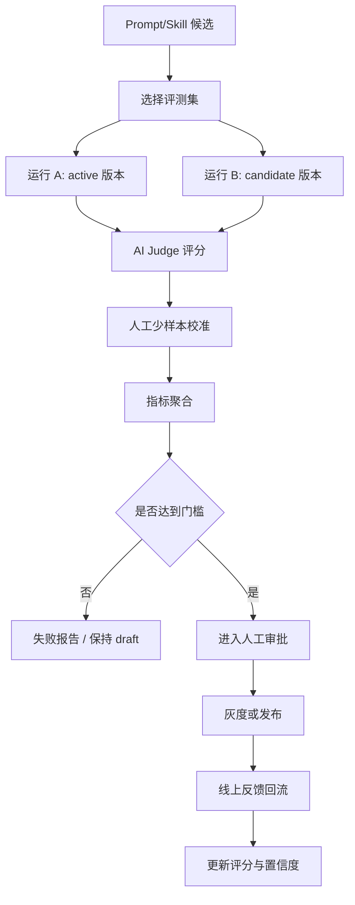

# sub-plan-scoring-evaluation: 评分机制与 Evaluation 执行计划

## 1. 目标

建立一套可解释、可回放、可比较的评分与评测体系，用来回答：

- 单次任务是否完成得好？
- 记忆注入是否真的有帮助？
- RAG 检索是否找对了上下文？
- 新 Prompt/Skill 是否优于旧版本？
- 是否可以进入人工审批或发布？

MVP 阶段先使用可解释公式和小样本人工校准，后续再引入学习排序或自动优化。

## 2. 技术依据

- RAGAS 将 RAG 评测拆成 context precision、context recall、faithfulness、answer relevancy 等维度。
- LangSmith 等评测工具强调 dataset、LLM-as-judge、回归评测和版本对比。
- AI judge 适合规模化评估，但必须用人工少样本校准，避免评测虚高。

## 3. 任务质量分

### 3.1 宏观指标

```text
adoption_rate =
  accepted_or_minor_edit_tasks / completed_tasks

completion_rate =
  tasks_meeting_success_criteria / all_finished_tasks

correction_rate =
  correction_count / completed_tasks

first_pass_success_rate =
  first_pass_success_tasks / completed_tasks

memory_hit_utility =
  avg(score_with_memory - score_without_memory)

ai_judge_human_agreement =
  agreement(judge_pass_fail, human_pass_fail)
```

MVP 门槛：

```text
adoption_rate >= 0.60
completion_rate >= 0.75
correction_rate <= 0.40
first_pass_success_rate >= 0.50
context_precision >= 0.75
context_recall >= 0.60
ai_judge_human_agreement >= 0.75
```

连续 3 次同类修正，或 memory_hit_utility 连续 20 个样本 <= 0，应触发 Prompt/Skill/Memory 检查。

### 3.2 单次任务质量分

```text
task_quality_score =
  0.30 * completion_score +
  0.20 * adoption_score +
  0.15 * first_pass_score +
  0.15 * style_match_score +
  0.10 * tool_success_score +
  0.10 * low_correction_score
  - risk_penalty
```

字段：

```text
completion_score:
  是否满足显式验收标准，0-1。

adoption_score:
  1.0 用户直接采纳
  0.7 轻微修改后采纳
  0.3 大幅修改后可用
  0.0 拒绝

first_pass_score:
  1.0 首次达标
  0.6 一次补充后达标
  0.2 多次修正后达标
  0.0 仍未达标

low_correction_score:
  max(0, 1 - correction_count / 3)
```

阈值：

```text
task_quality_score >= 0.85: 高质量样本，可进入聚类 exemplar。
0.70 - 0.85: 普通正样本。
0.45 - 0.70: 中性样本，只用于统计。
< 0.45: 负样本，用于失败模式和回归集。
```

## 4. 记忆有效分

```text
memory_effective_score =
  0.25 * confidence +
  0.20 * importance +
  0.20 * freshness +
  0.15 * evidence_strength +
  0.10 * scope_match +
  0.10 * usage_utility
  - contradiction_penalty
  - privacy_penalty
```

阈值：

```text
>= 0.80: 强上下文候选，可优先注入。
0.65 - 0.80: 可检索，可低权重注入。
0.45 - 0.65: 仅候选展示，不默认注入。
< 0.45: 不注入。
高风险隐私标记: 无论分数多少，必须人工确认。
```

## 5. RAG 专项指标

```text
context_precision =
  relevant_retrieved_contexts / retrieved_contexts

context_recall =
  expected_relevant_contexts_retrieved / expected_relevant_contexts

memory_precision =
  helpful_injected_memories / injected_memories

wrong_memory_rate =
  harmful_or_irrelevant_memories / injected_memories

faithfulness:
  输出中的事实是否能被检索上下文、当前仓库或用户输入支持。
```

## 6. Prompt/Skill 候选发布分

```text
evolution_candidate_score =
  0.30 * eval_improvement +
  0.20 * regression_pass_rate +
  0.15 * task_cluster_support +
  0.15 * user_feedback_support +
  0.10 * simplicity_score +
  0.10 * safety_score
  - prompt_bloat_penalty
  - overfit_penalty
```

阈值：

```text
>= 0.80: 可进入发布审批。
0.65 - 0.80: 观察队列，需要更多样本。
< 0.65: 不生成发布提案。
```

硬门槛：

```text
- regression_pass_rate >= 0.95。
- 高风险回归案例失败数 = 0。
- Prompt token 平均增长 <= 15%。
- 核心任务完成度相对 active 版本提升或持平。
- AI judge 与人工 pass/fail 一致率 >= 0.75。
- 必须人工 approve。
```

## 7. 人工少样本评测集

首批建立 20-50 条高质量样本。

```text
eval_case
- task_type
- intent
- domain
- input_context
- expected_behavior
- expected_output_traits
- must_use_memory
- must_not_use_memory
- success_criteria
- completion_score
- style_match_score
- risk_notes
- gold_answer_or_reference
```

样本类型：

```text
golden_success: 历史高质量任务。
preference_strict: 用户偏好强约束任务。
memory_conflict: 新旧记忆冲突任务。
stale_memory: 过期事实任务。
negative_cases: 不应该使用某条记忆的任务。
high_risk: 隐私、破坏性操作、跨项目复用。
cold_start: 无历史上下文任务。
```

## 8. AI Judge

### 8.1 输入

```text
- 原始用户请求。
- 当前任务上下文。
- 使用的 Prompt 版本。
- 注入的记忆列表。
- Agent 输出。
- 人工评分 rubric。
- 安全边界。
```

### 8.2 输出

```text
scores:
  intent_understanding: 1-5
  completion: 1-5
  style_match: 1-5
  memory_use: 1-5
  factuality: 1-5
  safety: pass/fail
pass_fail:
failure_reasons:
suggested_prompt_fix:
confidence:
```

一致性要求：

```text
- AI judge 与人工评分平均差 <= 0.8 分。
- pass/fail 一致率 >= 0.75。
- 低一致性样本进入人工复核。
- AI judge 不得独立决定 Prompt/Skill 发布。
```

## 9. Evaluation 流程



## 10. A/B 对比

```text
A: 当前 active Prompt/Skill。
B: 新候选 Prompt/Skill。
```

指标：

```text
quality_win_rate = B 优于 A 的案例数 / 总案例数
completion_delta = B_completion_avg - A_completion_avg
correction_delta = B_correction_avg - A_correction_avg
style_delta = B_style_avg - A_style_avg
token_delta = B_prompt_tokens_avg - A_prompt_tokens_avg
risk_fail_delta = B_risk_fail_count - A_risk_fail_count
```

上线建议：

```text
- 离线 B 胜率 >= 0.55。
- 核心任务完成度提升 >= 5% 或持平但降低修正率。
- 高风险失败不增加。
- token 增长 <= 15%。
- 线上灰度初始流量 <= 10%。
```

## 11. 执行步骤

1. 实现 `task_quality_score`。
2. 实现 `memory_effective_score`。
3. 实现 RAG 专项指标计算。
4. 定义 eval case schema。
5. 建立首批 20-50 条 eval cases。
6. 实现 AI judge prompt 与结构化输出。
7. 实现 `EvaluationRunner`。
8. 实现 A/B 对比报告。
9. 将评分写入 `prompt_runs.metrics_json`、`eval_results.scores_json`。
10. 发布前执行门禁检查。

## 12. 验收标准

- 10 条样例任务可生成完整评分。
- 每个分数都有数据来源和重算能力。
- 至少 20 条 eval cases 可自动运行。
- AI judge 结果可写入 eval_results。
- A/B 报告能展示每类任务胜负分布。
- 未通过门禁的 Prompt/Skill 不会 active。

## 13. 风险处理

| 风险 | 处理 |
| --- | --- |
| AI judge 虚高 | 用人工少样本校准，一致性不足进入复核 |
| 指标过拟合 | 保留 negative/high_risk/cold_start 回归集 |
| Prompt 变长但无收益 | prompt_bloat_penalty 和 token 增长门槛 |
| 只优化平均分 | 按 task_type/project/risk_level 分桶报告 |
| 用户反馈与 judge 冲突 | 用户反馈优先，judge 只做辅助 |

## 14. 参考资料

- RAGAS metrics: https://docs.ragas.io/en/stable/concepts/metrics/available_metrics/
- LangSmith evaluation: https://docs.smith.langchain.com/evaluation
- scikit-learn calibration: https://scikit-learn.org/stable/modules/calibration.html
