# 个性化 Prompt 增强 Agent 子计划索引

## 1. 文档定位

本文件是多份 `sub-plan-*.md` 的总导航。每个子计划都是可独立执行的施工文档，面向后续执行 AI 或子 Agent。

拆分原则：

- 每份文件只负责一个清晰方向。
- 每份文件都包含执行依据、数据结构、流程图、执行步骤、验收标准和风险处理。
- 所有方向共同遵守本地优先、证据驱动、人工确认、可回滚、可评测的原则。
- Prompt/Skill 的自动进化只生成候选，MVP 阶段必须人工确认后才能 active。

## 2. 子计划文件

| 文件 | 方向 | 交付重点 |
| --- | --- | --- |
| [sub-plan-memory.md](./sub-plan-memory.md) | 三层记忆系统 | L1/L2/L3 memory、证据链、人工复核、冲突处理 |
| [sub-plan-database.md](./sub-plan-database.md) | 数据库与存储 | PostgreSQL、pgvector、Redis、索引、迁移、artifact |
| [sub-plan-rag-graph.md](./sub-plan-rag-graph.md) | RAG 与用户图谱 | Hybrid RAG、GraphRAG、RRF、ContextPack、Prompt 输入 |
| [sub-plan-scoring-evaluation.md](./sub-plan-scoring-evaluation.md) | 评分与 Evaluation | 任务质量分、记忆有效分、AI judge、回归集、A/B |
| [sub-plan-confidence-decay.md](./sub-plan-confidence-decay.md) | 置信与衰减 | 证据权重、半衰期、冲突更新、注入阈值 |
| [sub-plan-clustering-evolution.md](./sub-plan-clustering-evolution.md) | 聚类与自进化 | HDBSCAN、任务簇、Prompt/Skill 候选、审批与回滚 |
| [sub-plan-reliability-governance.md](./sub-plan-reliability-governance.md) | 可靠性与治理 | 边界处理、SLO、可观测性、安全、发布门禁、事故复盘 |

## 3. 全链路关系

### 3.1 子计划协作图谱

下图描述多份 `sub-plan-*.md` 的协作关系：数据库与存储是事实源，记忆和置信衰减提供可控知识，RAG/GraphRAG 将经验转为可解释上下文，评分评测验证有效性，聚类进化生成候选，可靠性治理决定是否发布。


### 3.2 可编辑依赖流程图

```mermaid
flowchart LR
    classDef input fill:#F8FAFC,stroke:#CBD5E1,color:#0F172A
    classDef db fill:#EFF6FF,stroke:#93C5FD,color:#0F172A
    classDef memory fill:#F4F0FF,stroke:#C4B5FD,color:#0F172A
    classDef rag fill:#ECFEFF,stroke:#67E8F9,color:#0F172A
    classDef eval fill:#ECFDF5,stroke:#86EFAC,color:#0F172A
    classDef evo fill:#FFF1F2,stroke:#FDA4AF,color:#0F172A
    classDef gov fill:#F8FAFC,stroke:#94A3B8,color:#0F172A
    classDef decay fill:#FFF7ED,stroke:#FDBA74,color:#0F172A

    Start["用户任务 / 对话<br/>工具调用、产物、反馈、显式修正"]:::input
    Event["事件账本<br/>trace_id、interaction_events、tool_calls、artifacts、feedback_items"]:::input

    Start --> Event

    DB["sub-plan-database.md<br/>PostgreSQL 事实源<br/>pgvector / 全文索引<br/>Redis / Artifact Store<br/>迁移、约束、索引、归档"]:::db
    Event --> DB

    subgraph Knowledge["知识沉淀层"]
        Memory["sub-plan-memory.md<br/>L1 工作记忆<br/>L2 用户/项目长期记忆<br/>L3 程序化技能记忆<br/>证据链、人工复核、冲突合并"]:::memory
        Decay["sub-plan-confidence-decay.md<br/>证据权重、来源可靠度<br/>半衰期、freshness、importance<br/>冲突更新、注入阈值、失效策略"]:::decay
    end

    DB --> Memory
    DB --> Decay
    Memory <--> Decay

    subgraph Retrieval["检索与上下文层"]
        RAG["sub-plan-rag-graph.md<br/>Hybrid RAG / RRF<br/>GraphRAG 邻居扩展<br/>ContextPack / source_map<br/>Prompt 输入可解释"]:::rag
        Prompt["PromptCompiler 输入<br/>任务契约、用户偏好、项目事实、相似成功任务、失败模式、Skill 片段"]:::rag
    end

    Memory --> RAG
    Decay --> RAG
    DB --> RAG
    RAG --> Prompt

    Agent["Agent 执行<br/>模型路由、工具计划、状态机、产物生成、失败恢复"]:::input
    Prompt --> Agent --> Event

    subgraph Quality["评分与评测层"]
        Score["sub-plan-scoring-evaluation.md<br/>任务质量分、记忆有效分、RAG 指标<br/>AI judge、人工少样本、回归集、A/B"]:::eval
        Cases["Regression Cases<br/>常规成功、强偏好、相似历史、高风险、冲突记忆、过期记忆"]:::eval
    end

    Agent --> Score
    Cases --> Score
    Score --> Decay

    subgraph Evolution["聚类与进化层"]
        Cluster["sub-plan-clustering-evolution.md<br/>HDBSCAN / 相似任务簇<br/>最优方案、失败模式、用户习惯簇"]:::evo
        Proposal["Prompt / Skill 候选<br/>diff、适用范围、不适用条件、预期收益、回滚点"]:::evo
    end

    Score --> Cluster --> Proposal
    Memory --> Cluster
    RAG --> Cluster

    subgraph Governance["可靠性与发布治理"]
        Gate["sub-plan-reliability-governance.md<br/>ReliabilityGate、SLO/error budget<br/>Prompt Injection、隐私脱敏、scope 隔离"]:::gov
        Approval["人工审批<br/>记忆确认、Prompt/Skill 审批、删除导出、策略修订"]:::gov
        Registry["版本注册表<br/>active、deprecated、rejected、rolled_back、freeze"]:::gov
        Incident["事故复盘<br/>P0/P1 冻结发布、补回归用例、修复项追踪"]:::gov
    end

    Proposal --> Gate --> Approval --> Registry --> Prompt
    Gate --> Cases
    Gate --> Incident
    Incident --> DB
    Registry --> DB
```



## 4. 推荐执行顺序

```text
第 1 步：sub-plan-database.md
  先建立事件账本、记忆、向量、图谱、评测和审批的存储基础。

第 2 步：sub-plan-memory.md
  实现记忆候选抽取、三层记忆管理、人工复核与冲突处理。

第 3 步：sub-plan-confidence-decay.md
  实现置信度、证据权重、时间衰减和记忆注入阈值。

第 4 步：sub-plan-rag-graph.md
  实现向量、全文、图谱混合检索和 ContextPack。

第 5 步：sub-plan-scoring-evaluation.md
  实现任务质量、记忆有效性、AI judge、回归集和 A/B 对比。

第 6 步：sub-plan-clustering-evolution.md
  实现历史任务聚类、成功/失败模式挖掘、Prompt/Skill 候选、审批和回滚。

第 7 步：sub-plan-reliability-governance.md
  补齐 SLO/error budget、OpenTelemetry、边界矩阵、安全门禁、事故复盘和发布冻结策略。
```

## 5. MVP 总体验收

MVP 完成时，应能演示：

1. 记录一段真实任务对话、工具调用和产物。
2. 抽取任务元数据和记忆候选。
3. 人工确认一条长期记忆并写入索引。
4. 新任务开始时检索相关记忆、项目事实、相似成功任务和失败模式。
5. 生成结构化 ContextPack 并编译个性化 Prompt。
6. 任务结束后计算任务质量分、记忆有效分和 RAG 指标。
7. 根据反馈更新置信度和 freshness。
8. 聚类历史任务，生成一个 Prompt 或 Skill 候选。
9. 候选通过回归评测和可靠性门禁后进入人工审批。
10. 审批通过后发布新版本，并支持灰度、监控、冻结和回滚。

## 6. 统一参考资料

- MemGPT: Towards LLMs as Operating Systems, https://arxiv.org/abs/2310.08560
- Letta memory blocks, https://docs.letta.com/guides/core-concepts/memory-blocks
- Letta archival memory, https://docs.letta.com/guides/core-concepts/memory/archival-memory/
- pgvector official repository, https://github.com/pgvector/pgvector
- PostgreSQL full text search, https://www.postgresql.org/docs/current/textsearch.html
- GraphRAG paper, https://arxiv.org/abs/2404.16130
- Microsoft GraphRAG documentation, https://microsoft.github.io/graphrag/
- RAGAS metrics, https://docs.ragas.io/en/stable/concepts/metrics/available_metrics/
- LangSmith evaluation, https://docs.smith.langchain.com/evaluation
- DSPy paper, https://arxiv.org/abs/2310.03714
- HDBSCAN documentation, https://hdbscan.readthedocs.io/en/latest/how_hdbscan_works.html
- scikit-learn clustering, https://scikit-learn.org/stable/modules/clustering.html
- scikit-learn calibration, https://scikit-learn.org/stable/modules/calibration.html
- Reciprocal Rank Fusion, https://plg.uwaterloo.ca/~gvcormac/cormacksigir09-rrf.pdf
- NIST AI RMF, https://www.nist.gov/itl/ai-risk-management-framework
- OWASP Top 10 for LLM Applications, https://owasp.org/www-project-top-10-for-large-language-model-applications/
- OpenTelemetry documentation, https://opentelemetry.io/docs/
- Google SRE SLOs, https://sre.google/sre-book/service-level-objectives/
